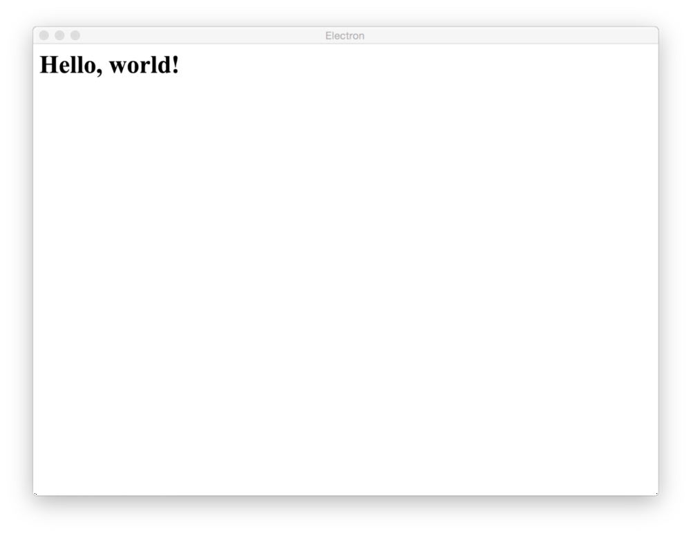
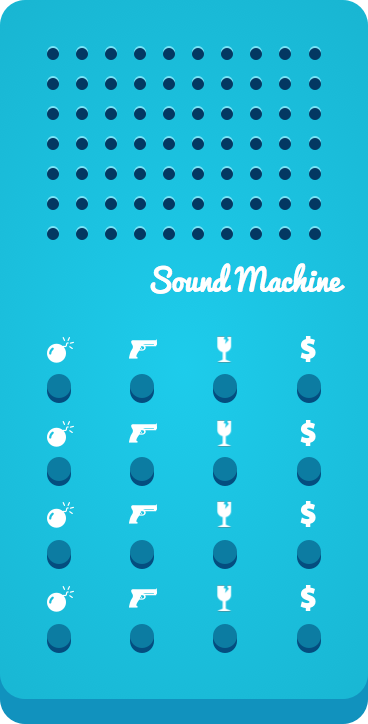
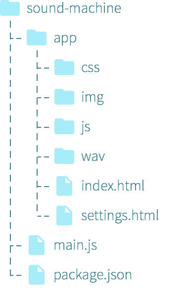
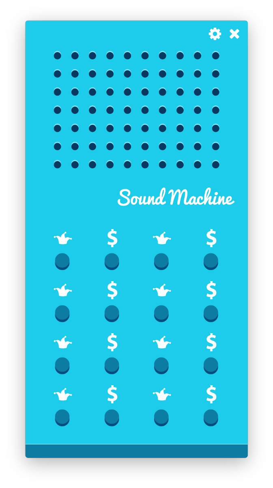
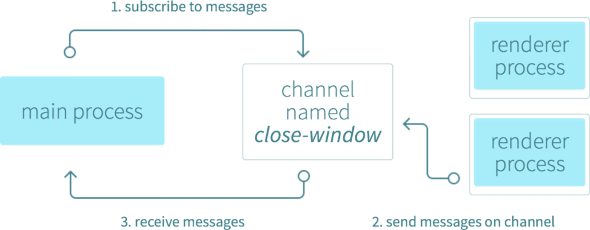
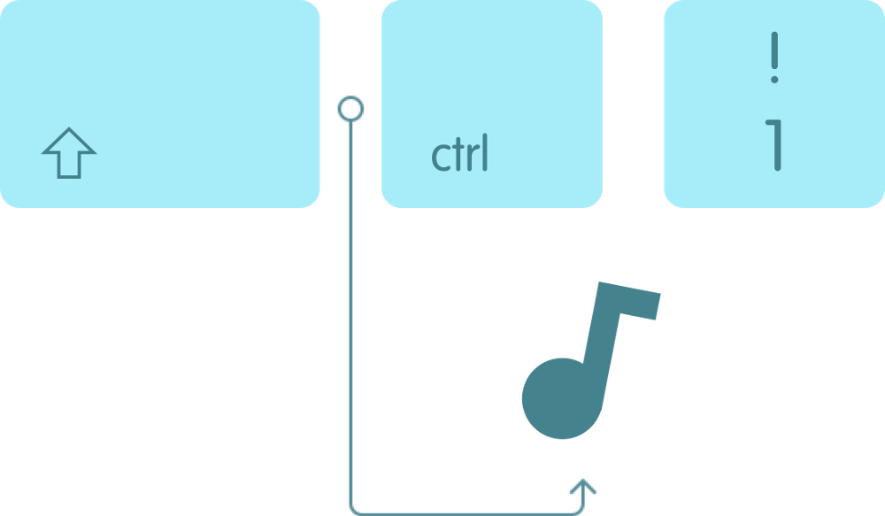

原文链接：[Building a desktop application with Electron](https://medium.com/developers-writing/building-a-desktop-application-with-electron-204203eeb658)
。
> 译者注：译者尚未实践本教程，预计将在本周末使用**新Mac**实践。若在此之前有朋友踩坑，请通知译者，译者将在实践后更改之。

# Building a desktop application with Electron
# 使用 Electron 构建桌面应用

## A detailed guide on building your very own sound machine using JavaScript, Node.js and Electron
## 使用 JavaScript、Node.js 和 Electron 创造专属于你的声效器

### The how and what of JavaScript desktop applications
### JavaScript 桌面应用是什么

Desktop applications always had a special place in my heart. Ever since browsers and mobile devices got powerful, there’s been a steady decline of desktop applications which are getting replaced by mobile and web applications. Still, there’s are a lot of upsides to writing desktop applications — they are always present once they’re in your start menu or dock, they’re alt(cmd)-tabbable (I hope that’s a word) and mostly connect better with the underlying operating system (with its shortcuts, notifications, etc) than web applications.

即使在移动端和云端大行其道而，桌面端日渐落末的现在，我的心中仍然为桌面应用留有一个特殊的位置。和 Web 应用比起来桌面应用的优点还是很多的：只要把它们放在开始菜单栏或者 dock 上，你就能随时打开它们；还可以通过``` alt-tab ```或者``` cmd-tab ```切换应用；和操作系统之间的交互更良好（快捷键，通知栏等）。

In this article, I’ll try to guide you through the process of building a simple desktop application and touch on important concepts for building desktop application with JavaScript.

我将会在这篇文章中指导构建一个简单的桌面应用。当然，你也将了解到在使用 JavaScript 构建桌面应用的时候要哪些重要的概念。

The main idea behind developing desktop applications with JavaScript is that you build one codebase and package it for each operating system separately. This abstracts away the knowledge needed to build native desktop applications and makes maintenance easier. Nowadays, developing a desktop application with JavaScript relies on either Electron or NW.js. Although both tools offer more or less the same features, I went with Electron because it has some advantages I found important. At the end of the day, you can’t go wrong with either.

使用 JavaScript 开发桌面应用意味着在打包（package application）的时候你会需要根据操作系统的不同发出不同的命令。这一行为是将原生桌面应用兼容不同平台的概念抽象出来，方便维护应用。现在，我们可以借助 Electron 或者 NW.js 开发一个桌面应用。其实这两者提供的或多或少差不多的特性，但对于我来说，还是更偏向于 Electron。在做出选择之前，先详细了解它们并考虑各种情况，就不会选错的。

#### Basic assumptions
#### 基本假设

I assume that you’ve got your basic text editor (or IDE) and Node.js/npm installed. I’ll also assume you’ve got HTML/CSS/JavaScript knowledge (Node.js knowledge with CommonJS modules would be great, but isn’t crucial) so we can focus on learning Electron concepts without worrying about building the user interface (which, as it turns out, are just common web pages). If not, you’ll probably feel somewhat lost and I recommend visiting my previous blog post to brush up on your basics.

开始教程之前，请允许我假设你已经有了一个常用的的编辑器（或者 IDE），系统中也安装了 [Node.js 和 npm](https://nodejs.org/download/)，并有基础的 HTML/CSS/JavaScript （对 Node.js 的 CommonJS 模块概念有所了解是最好，但不强求） 知识。如果以上知识你并不了解，为了防止这篇文章看到你头昏脑胀，推荐你先看看之前我写过的[博文](https://medium.com/@bojzi/overview-of-the-javascript-ecosystem-8ec4a0b7a7be)，补充一下基础知识。

万事俱备，现在就把精力集中在学习 Electron 上，不要再担心界面的事情（将会构建的界面本质上就是普通的 Web 页面而已）。

#### A 10,000 foot view of Electron
#### Electron 概览

In a nutshell, Electron provides a runtime to build desktop applications with pure JavaScript. The way it works is — Electron takes a main file defined in your package.json file and executes it. This main file (usually named main.js) then creates application windows which contain rendered web pages with the added power of interacting with the native GUI (graphical user interface) of your operating system.

简而言之，Electron 提供了一个实时构建桌面应用的纯 JavaScript 环境。Electron 可以获取到你定义在* package.json *中* main *文件内容，然后执行它。通过这个文件（通常我们称之为* main.js *），可以创建一个应用窗口，这个应用窗口包含一个渲染好的 web 界面，还可以和系统原生的 GUI 交互。

In detail, once you start up an application using Electron, a main process is created. This main process is responsible for interacting with the native GUI of your operating system and creates the GUI of your application (your application windows).

具体来说，就是当你启动了一个 Electron 应用，就有一个主进程（* main process *）被创建了。这条进程将负责创建出应用的 GUI（也就是应用的窗口），并处理用户与这个 GUI 之间的交互。

Purely starting the main process doesn’t give the users of your application any application windows. Those are created by the main process in the main file by using something called a BrowserWindow module. Each browser window then runs its own renderer process. This renderer process takes a web page (an HTML file which references the usual CSS files, JavaScript files, images, etc.) and renders it in the window. Your web pages are rendered with Chromium so a very high level of compatibility with standards is guaranteed.

但直接启动* main.js *是无法显示应用窗口的，在* main.js *中通过调用``` BrowserWindow ```模块才能将使用应用窗口。然后每个浏览器窗口将执行它们各自的渲染器进程（* renderer
 process *）。渲染器进程将会处理一个真正的 web 页面（HTML + CSS + JavaScript），将页面渲染到窗口中。鉴于 Electron 使用的是基于 [Chrominum](https://www.chromium.org/) 的浏览器内核，你就不太需要考虑兼容的问题。

For example, if you only had a calculator application, your main process would instantiate a window with a web page where your actual web page (calculator) is.

举个例子，如果你只想做一个计算器，那你的* main process *只会做一件事情：实例化一个窗口，并内置了一个计算器的界面（这个界面是你用 HTML、CSS 和 JavaScript 写的）。

Although it is said that only the main process interacts with the native GUI of your operating system, there are techniques to offload some of that work to renderer processes (we’ll look into building a feature leveraging such a technique).

虽然理论上只有* main process *才能和原生 GUI 产生交互，但其实我们可以通过一些手段让* renderer process *与原生 GUI 交互（在后文中你将学习到如何实现）。

The main process can access the native GUI through a series of modules available directly in Electron. Your desktop application can access all Node modules like the excellent node-notifier to show system notifications, request to make HTTP calls, etc.

*main process *可以通过 Electron 中的[一些模块](https://github.com/atom/electron/tree/master/docs/api)直接和原生 GUI 交互。你的桌面应用可以使用任意的 Node 模块，比如用 [node-notifier](https://github.com/mikaelbr/node-notifier) 显示系统通知，用 [request](https://www.npmjs.com/package/request) 发出 HTTP 请求……

### Hello, world!
### Hello, world!

Let’s get started with a traditional greeting and install all the necessary prerequisites.

做好前期准备，现在让我们从 Hello World 开始吧！

#### Accompanying repository
#### 使用的 repo

This guide is accompanied by the sound-machine-tutorial repository.
Use the repository to follow along or continue at certain points. Clone the repository to get started:

这篇教程是基于一个声效器教程的 [github 仓库](https://github.com/bojzi/sound-machine-electron-guide)，请使用下面的命令将它克隆到本地：

```bash
git clone https://github.com/bojzi/sound-machine-electron-guide.git
```

and then you can jump to a git tag in the sound-machine-tutorial folder with:
然后查看一下，你可以看看这个仓库中有哪些 tag：

```bash
git checkout <tag-name>
```

I’ll let you know when a tag is available with a code block:
我们将跟随这些 tag 将声效器一步步构建出来：

```bash
git checkout 00-blank-repository
```

Once you clone/checkout your desired tag, run:
拉取（checkout）目标 tag 之后，执行：

```bash
npm install
```

so that you aren’t missing any Node modules.
这么做能保证项目所依赖的 Node 模块都会被拉取。

If you can’t switch to another tag, it would be easiest to just reset your repository state and then do the checkout:
如果你无法切换到某一个 tag，最简单的解决方式就是重置仓库，然后再 checkout：

```bash
git add -A
git reset --hard
```

#### Set up shop
#### 开工

Follow along with the tag 00-blank-repository:
*先把 tag 为 ‘00-blank-repository’ 拉取下拉：*

```bash
git checkout 00-blank-repository
```

In the project folder create a new package.json file in it with the following contents:
在项目文件夹中创建一个 *package.json* 文件，并在文件中加入以下内容：

```json
{
    "name": "sound_machine",
    "version": "0.1.0",
    "main": "./main.js",
    "scripts": {
        "start": "electron ."
    }
}
```
This barebones package.json:
这个* package.json *的作用是：

+ sets up the name and version of the application,
+ 确定应用的名字和版本号，
+ lets Electron know which script the main process is going to run (main.js) and
+ 告诉 Electron *main.js* 是* main process *的入口，
+ sets up a useful shortcut — an npm script to run the application easily by running “npm start” in your CLI (terminal or command prompt).
+ 定义启动口令 - 在 CLI （终端或者命令行）中执行 ```npm start``` 即可完成依赖安装。

It’s time to get Electron. The easiest way of accomplishing that is by installing a prebuilt binary for your operating system through npm and save it as a development dependency in your package.json (that happens automatically with --save-dev). Run the following in your CLI (in the project folder):
现在快把* Electron *安装上吧。最简单的安装方式应该是通过* npm *安装预构建好的二进制文件，然后把它作为开发依赖（development dependency）写入 package.json 中（安装时带上 ```--save-dev``` 参数即可自动写入依赖）。在 CLI 中进入项目目录，执行下面的命令：

```bash
npm install --save-dev electron-prebuilt
```

The prebuilt binary is tailored to the operating system it’s being installed on and allows the running of “npm start”. We’re installing it as a development dependency because we will only need it during development.
预构建的二进制文件会根据操作系统不同而不同的，通过执行 ```npm start``` 安装。我们以开发依赖的方式使用它，是因为在项目构建中只有在开发阶段才会使用到 Electron。

That’s, more or less, everything you need to start developing with Electron.
以上，就是本次* Electron *教程所需要的全部东西了。

#### Greeting the world
#### 对世界说 Hi

Create an app folder and an index.html file in that folder with the following contents:
创建一个** app **文件夹，在文件夹中新建* index.html *文件，并写入以下内容：

```html
<h1>Hello, world!</h1>
```

In the root of the project create a main.js file. That’s the file that Electron’s main process is going to spin up and allow the creation of our “Hello, world!” web page. Create the file with the following contents:
在项目的根目录创建* main.js *文件。Electron 主线程的入口是这个 JS 文件，然后 “Hello world!” 页面也通过它显示出来：

```javascript
'use strict';

var app = require('app');
var BrowserWindow = require('browser-window');

var mainWindow = null;

app.on('ready', function() {
    mainWindow = new BrowserWindow({
        height: 600,
        width: 800
    });

    mainWindow.loadUrl('file://' + __dirname + '/app/index.html');
});
```

Nothing scary, right?
看起来并不难吧？

The app module controls your application lifecycle (for example — reacting to the ready state of your application).
```app``` 模块控制着应用的生命周期（比如，当应用进入准备状态（ready status）的时候要采取什么行动）。

The BrowserWindow module allows window creation.
```BrowserWindow``` 模块控制窗口的创建。

The mainWindow object is going to be your main application window and is declared as null because the window would otherwise be closed once JavaScripts garbage collection kicks in.
```mainWindow``` 对象就是你的应用窗口的主界面，当 JavaScript 垃圾回收机制被触发时窗口就会被关闭，此时该对象的值是``` null ```。

Once app gets the ready event, we create a new 800 pixels wide and 600 pixels high window using BrowserWindow.
当 ```app``` 获取到 ```ready``` 事件后，我们通过``` BrowserWindow ```创建一个 800x600 窗口。

That window’s renderer process is going to render our index.html file.
这个 window 的渲染器线程将会渲染 index.html 文件。

Run our “Hello, World!” application by running the following in your CLI:
执行下面这行代码，看看我们的应用是什么样的：

```bash
npm start
```

and bask in the glory that is your app.
现在沐浴在这个 app 的圣光中吧。


### Developing a real application
### 开发一个真正的应用

#### A glorious sound machine
#### 华丽丽的声效器

First things first — what’s a sound machine?
开始之前，我要问个问题：什么是声效器？

A sound machine is a little device that makes sounds when you press various buttons, mostly cartoon or reaction sounds. It’s a funny little tool to lighten up the mood in an office and a great use case to develop a desktop application as we’re going to explore quite a few concepts while developing it (and get a nifty sound machine to boot).
声效器是一个小设备，当你按下不同按键的时候，它会发出不同声音，比如卡通音或者效果音。在办公室里听到这样有趣的声音，好像整个人都明亮起来了呢。用这个例子作为探索如何使用 Electron 是个很棒的主意。



The features we’re going to build and concepts we’re going to explore are:
具体来说，我们将会实现以下功能，并涉及到以下知识：

+ basic sound machine (basic browser window instantiation),
+ 声效器的基础（实例化浏览器窗口），
+ closing the sound machine (remote messages between main and renderer process),
+ 关闭声效器（主进程和渲染器进程之间的通信），
+ playing sounds without having the application in focus (global keyboard shortcuts),
+ 随时播放声音（全局快捷键），
+ creating a settings screen for shortcut modifier keys (Shift, Ctrl and Alt) (storing user settings in home folder),
+ 创建一个快捷修饰键（修饰键，modifier keys， 指的是 Shift、Ctrl 和 Alt 键）设置页面（并将用户设置保存在主目录下），
+ adding a tray icon (remotely creating native GUI elements and getting to know menus and tray icon) and
+ 添加一个托盘图标（创建原生 GUI 元素、了解菜单和托盘图标的使用）,
+ packaging your application (packaging your application for Mac, Windows and Linux).
+ 将应用打包到 Mac、Windows 和 Linux 平台。

### Building the basic feature of a sound machine
### 实现声效器的基本功能

#### Starting point and application organisation
#### 开始构建以及应用的结构

With a working “Hello, world!” application under your belt, it’s high time to start building a sound machine.
在开发过 "Hello World" 应用之后，现在可以着手制做我们的声效器了。

A typical sound machine features several rows of buttons which respond to presses by making sounds. The sounds are mostly cartoonish and/or reaction based (laughter, clapping, glass breaking, etc.).
一个典型的声效器会有很多的按钮，你需要按下那些按钮才能让机器发声，通常会是拟声词（比如笑声、掌声、打碎玻璃的声音等等）。

That’s also the very first feature we’ll build — a basic sound machine that responds to clicks.
响应点击 -- 这是我们要做的第一件事情。

Our application structure is going to be very straightforward.
我们的应用结构非常简单直白。


In the root of the application we’ll keep the package.json file, the main.js file and any other application-wide files we need.
在应用的**根目录**中，要有一个* package.json*、*main.js *和其他全局所需的应用文件。

The app folder will house our HTML files of various types within folders like css, js, wav and img.
**app/ **目录中要包含 HTML 文件、**CSS **目录、**JS **目录、**wav **目录还有图片目录。

To make things easier, all the files needed for web page design have already been included in the initial state of the repository. Please check the tag 01-start-project out. If you followed along and created the “Hello, world!” application, you’ll have to reset your repository and then do the checkout:
出于简化这个教程的目的，所有和网页设计相关的文件都已经在一开始就放在仓库中了。请在命令行中输入 ```git checkout 01-start-project``` 获取。现在，请你可以输入以下命令，重置你的仓库并拉取新的 tag：

```bash
If you followed along with the "Hello, world!" example:
git add -A
git reset --hard
Follow along with the tag 01-start-project:
git checkout 01-start-project
```

To keep things simple, we’re going to have only two sounds but extending it to the full 16 sounds is simply a matter of finding extra sounds, extra icons and modifying index.html.
在本教程中，我们只使用两种声效，后面再找一些别的音效和图标，修改* index.js *就将它们扩展成有16种音效的声效器。

#### Defining the rest of the main process
#### main process 的其他内容

Let’s revisit main.js to define the look of the sound machine. Replace the contents of the file with:
首先找到* main.js *中定义声效器外形的部分，用下面这段替换掉：

```javascript
'use strict';

var app = require('app');
var BrowserWindow = require('browser-window');

var mainWindow = null;

app.on('ready', function() {
    mainWindow = new BrowserWindow({
        frame: false,
        height: 700,
        resizable: false,
        width: 368
    });

    mainWindow.loadUrl('file://' + __dirname + '/app/index.html');
});
```

We’re customising the window we’re creating by giving it a dimension, making it non-resizable and frameless. It’s going to look like a real sound machine hovering on your desktop.
当窗口被定义了大小，我们也就是在自定义这个窗口，使得它不可拉伸没有框架，让它看起来就像一个真正的声效器浮在桌面上。

The question now is — how to move a frameless window (with no title bar) and close it?
现在问题来了 -- 要如何移动或者关闭一个没有标题栏的窗口。

I’ll talk about custom window (and application) closing very soon (and introduce a way of communicating between the main process and a renderer process), but the dragging part is easy. If you look at the index.css file (in app/css), you’ll see the following:
很快我就会说到自定义窗口（和应用）的关闭动作，还会谈到如何在主进程和渲染器进程中通信。不过现在让我们先把目光聚焦到“拖拽效果”上。你可以在** app/css **目录下找到* index.css *文件：

```css
html,
body {
    ...
    -webkit-app-region: drag;
    ...
}
```

-webkit-app-region: drag; allows the whole html to be a draggable object. There is a problem now, though — you can’t click buttons on a draggable object. The other piece of the puzzle is -webkit-app-region: no-drag; which allows you to define undraggable (and thus clickable elements). Consider the following excerpt from index.css:
``` -webkit-app-region: drag; ```把整个 html 都变成了一个可拖拽的对象。现在问题来了，在可拖拽的对象上你怎么点击啊？！好的，可能你会想到把 html 中某个部分的这个属性值设置为``` no-drag; ```，那就允许该元素不可拖拽（但可以点击了）。让我们想想下面这段 index.css 片段：

```css
.button-sound {
    ...
    -webkit-app-region: no-drag;
}
```

#### Displaying the sound machine in its own window
#### 展示声效器

The main.js file can now make a new window and display the sound machine. And really, if you start your application with npm start, you’ll see the sound machine come alive. It’s not a surprise that nothing’s happening right now because we just have a static web page.
现在通过* main.js *文件可以创建一个新窗口，并在窗口中显示出声效器的界面。如果通过``` npm start ```启动应用，你将会看到一个有动态效果的声效器。因为我们就是从一个静态页面开始，所以现在你看到的也是不会动的页面：

Put the following in the index.js file (located in app/js) to get the interactivity going:
将下面这段代码保存到* index.js *文件中（位置在 app/js 目录下），运行后应用后，你会发现可以与声效器交互了：

```javascript
'use strict';

var soundButtons = document.querySelectorAll('.button-sound');

for (var i = 0; i < soundButtons.length; i++) {
    var soundButton = soundButtons[i];
    var soundName = soundButton.attributes['data-sound'].value;

    prepareButton(soundButton, soundName);
}

function prepareButton(buttonEl, soundName) {
    buttonEl.querySelector('span').style.backgroundImage = 'url("img/icons/' + soundName + '.png")';

    var audio = new Audio(__dirname + '/wav/' + soundName + '.wav');
    buttonEl.addEventListener('click', function () {
        audio.currentTime = 0;
        audio.play();
    });
}
```

This code is pretty simple. We:
通过上面这段代码，我们：

+ query for the sound buttons,
+ 获取声音按钮，
+ iterate through the buttons reading out the data-sound attribute,
+ 迭代访问按钮的``` data-sound ```属性值，
+ add a background image to each button
+ 给每个按钮加上背景图，
+ and add a click event to each button that plays audio (using the HTMLAudioElement interface)
+ 通过 [HTMLAudioElement 接口](https://developer.mozilla.org/en/docs/Web/API/HTMLAudioElement)给每个按钮都添加一个点击事件，使之可以播放音频，

Test your application by running the following in your CLI:
通过下面这行命令运行你的应用吧：

```bash
npm start
```


### Closing the application from a browser window via remote events
### 通过远程事件从浏览窗口中关闭应用

Follow along with the tag 02-basic-sound-machine:
接着拉取``` 02-basic-sound-machine ```的内容：

```bash
git checkout 02-basic-sound-machine
```

To recap — application windows (more exactly their renderer process) shouldn’t be interacting with the GUI (and that’s what closing a window is). The official Electron quick start guide says:
简单来说 - 应用窗口（渲染器进程）不应该和 GUI 发生交互（也就是不应该和“关闭窗口”有关联），[Electron 的官方教程](https://github.com/atom/electron/blob/master/docs/tutorial/quick-start.md)上说了：

> In web pages, it is not allowed to call native GUI related APIs because managing native GUI resources in web pages is very dangerous and it is easy to leak resources. If you want to perform GUI operations in a web page, the renderer process of the web page must communicate with the main process to request the main process perform those operations.
> 考虑到在网页中直接调用原生的 GUI 容易造成资源溢出，这很危险，开发者不能这么使用。如果开发者想要在网页上执行 GUI 操作，必须要通过渲染器进程和主进程的通信实现。

Electron provides the ipc (inter-process communication) module for that type of communication. ipc allows subscribing to messages on a channel and sending messages to subscribers of a channel. A channel is used to differentiate between receivers of messages and is represented by a string (for example “channel-1”, “channel-2”…). The message can also contain data. Upon receiving a message, the subscriber can react by doing some work and can even answer. The biggest benefit of messaging is separation of concerns — the main process doesn’t have to know which renderer processes there are or which one sent a message.
Electron 为主进程和渲染器进程提供了 ipc （跨进程通信）模块，ipc 模块允许接收和发送通信频道的信息。频道由字符串表示（比如“channel-1”，“channel-2”这样），可以用于区分不同的信息接收者。传递的信息中也可以包含数据。根据接收到的信息，订阅者可以做出响应。信息传递的最大好处就是做到分离任务 -- 主进程不需要知道是哪些渲染器进程发送了信息。



That’s exactly what we’ll do here — subscribe the main process (main.js) to the “close-main-window” channel and send a message on that channel from the renderer process (index.js) when someone clicks the close button.
这正是我们想要做的 -- 将主进程（*main.js*）订阅到“关闭主窗口”频道中，当用户点击关闭按钮时，从渲染器进程（index.js）向该频道发送信息。

Add the following to main.js to subscribe to a channel:
将下面的代码实现了频道订阅，将它添加到* main.js *中：

```javascript
var ipc = require('ipc');

ipc.on('close-main-window', function () {
    app.quit();
});
```

After requiring the module, subscribing to messages on a channel is very easy and involves using the on() method with the channel name and a callback function.
把 ipc 模块包含进来之后，从频道中订阅信息就非常简单了：过 ```on()``` 方法和频道名称，再加上一个回调函数就行了。

To send a message on that channel, add the following to index.js:
要向该频道发送信息，就要把下面的代码加入* index.js *中:

```javascript
var ipc = require('ipc');

var closeEl = document.querySelector('.close');
closeEl.addEventListener('click', function () {
    ipc.send('close-main-window');
});
```

Again, we require the ipc module and bind a click event to the element with the close button. On clicking the close button we send a message via the “close-main-window” channel with the send() method.
我们依然需要把* ipc *模块引入到文件中，给关闭按钮绑定点击事件。当点击了关闭按钮时，通过 ```send()``` 方法发送一条信息到“关闭主窗口”频道。

There’s one more detail that could bite you and we’ve talked about it already — the clickability of draggable areas. index.css has to define the close button as non-draggable.
不要忘记在在 *index.css* 中将关闭按钮设置为不可拖拽：

```css
.settings {
    ...
    -webkit-app-region: no-drag;
}
```

That’s all, our application can now be closed via the close button. Communicating via ipc can get complicated by examining the event or passing arguments and we’ll see an example of passing arguments later.
就这样，我们的应用现在可以通过按钮关掉了。* ipc *的通信可以通过事件和参数的传递变得很复杂，在后文中会有传递参数的例子。

### Playing sounds via global keyboard shortcuts
### 通过全局快捷键播放声音

Follow along with the tag 03-closable-sound-machine:
拉取``` 03-closable-sound-machine ```：

```bash
git checkout 03-closable-sound-machine
```

Our basic sound machine is working great. But we do have a usability issue — what use is a sound machine that has to sit in front of all your windows the whole time and be clicked repeatedly?
声效器的地基已经打的不错。但是我们还面临着使用性的问题 -- 这个应用要始终保持在桌面最前方，且可以被重复点击。

This is where global keyboard shortcuts come in. Electron provides a global shortcut module which allows you to listen to custom keyboard combinations and react. The keyboard combinations are known as Accelerators and are string representations of a combination of keypresses (for example “Ctrl+Shift+1”).
这就是全局快捷键要介入的地方。Electron 提供了[全局快捷模块](https://github.com/atom/electron/blob/master/docs/api/global-shortcut.md)（global shortcut module）允许开发者捕获组合键并做出相应的反应。在 Eelctron 中组合键被称为[加速器](https://github.com/atom/electron/blob/master/docs/api/accelerator.md)，它以字符串的形式被记录下（比如 “Ctrl+Shift+1”）。

Since we want to catch a native GUI event (global keyboard shortcut) and do an application window event (play a sound), we’ll use our trusted ipc module to send a message from the main process to the renderer process.
因为我们想要捕获到原生的 GUI 事件（全局快捷键），并执行应用窗口事件（播放声音），我们将使用 ipc 模块从主进程发送信息到渲染器进程。


Before diving into the code, there are two things to consider:
在看代码之前，还有两件事情要我们考虑：

1. global shortcuts have to be registered after the app “ready” event (the code should be in that block) and
1. 全局快捷键会在* app *的``` ready ```事件被触发后注册（相关代码片段要被包含在 'ready' 中）
2. when sending messages via ipc from the main process to a renderer process you have to use the reference to that window (something like “createdWindow.
webContents.send(‘channel’))
2. 通过* ipc *模块从主进程向渲染器进程发送信息，你必须使用窗口对象的引用（类似于 ``` createdWindow.webContents.send(‘channel’) ```）。

With that in mind, let’s alter our main.js and add the following code:
记住上面的两点了吗？现在让我们来改写* main.js *吧：

```javascript
var globalShortcut = require('global-shortcut');

app.on('ready', function() {
    ... // 之前写过的代码

    globalShortcut.register('ctrl+shift+1', function () {
            mainWindow.webContents.send('global-shortcut', 0);
    });
    globalShortcut.register('ctrl+shift+2', function () {
        mainWindow.webContents.send('global-shortcut', 1);
    });
});
```

First, we require the global-shortcut module. Then, once our application is ready, we register two shortcuts — one that will respond to pressing Ctrl, Shift and 1 together and the other that will respond to pressing Ctrl, Shift and 2 together. Each of those will send a message on the “global-shortcut” channel with an argument. We’ll use that argument to play the correct sound. Add the following to index.js:
首先，要先引入 ```global-shortcut``` 模块，当应用进入``` ready ```状态之时，我们将会注册两个快捷键 -- 'Ctrl+Shift+1' 和 'Ctrl+Shift+2'。这两个快捷键可以通过不同的参数向“全局快捷键”频道（ *“global-shortcut”* channel）发送信息。通过参数匹配到到底要播放哪种声音，将下面的代码加入 index.js 中：

```javascript
ipc.on('global-shortcut', function (arg) {
    var event = new MouseEvent('click');
    soundButtons[arg].dispatchEvent(event);
});
```

To keep thing simple, we’re going to simulate a button click and use the soundButtons selector that we’ve created while binding buttons to playing sounds. Once a message comes with an argument of 1, we’ll take the soundButtons[1] element and trigger a mouse click on it (note: in a production application, you’d want to encapsulate the sound playing code and execute that).
为了保证整个架构足够简单，我们将会用``` soundButtons ```选择器模拟按钮的点击播放声音。当发送的信息是“1”时，我们将会获取``` soundButtons[1] ```元素，触发鼠标点击事件（注意：在生产环境中的应用，你需要封装好播放声音的代码，然后执行它）。


### Configuring modifier keys via user settings in a new window
### 在新窗口中通过用户设置配置 modifier keys

Follow along with the tag 04-global-shortcuts-bound:
下面请拉取``` 04-global-shortcuts-bound ```：

```bash
git checkout 04-global-shortcuts-bound
```

With so many applications running at the same time, it could very well be that the shortcuts we’ve envisioned are already taken. That’s why we’re going to introduce a settings screen and store which modifiers (Ctrl, Alt and/or Shift) we’re going to use.
通常我们会同时运行好多个应用，声效器中设置的快捷键很可能已经被占用了。所以现在要引入一个设置界面，允许用户更改修饰键（modifier keys）的原因（Ctrl、Alt 和 Shift）。

To accomplish all of that, we’ll need the following:
要完成这一个功能，我们需要做下面这些事情：

+ a settings button in our main window,
+ 在主界面上添加设置按钮，
+ a settings window (with accompanying HTML, CSS and JavaScript files),
+ 实现一个设置窗口（设置页面上有对应的HTML、CSS 和 JS），
+ ipc messages to open and close the settings window and update our global shortcuts and
+ 开启和关闭设置窗口，以及更新全局快捷键的* ipc *信息，
+ storing/reading of a settings JSON file from the user system.
+ 从用户的系统中读写存储设置信息的 JSON 文件。

Phew, that’s quite a list.
piu~ 以上就是我们要做的。

#### Settings button and settings window
#### 设置按钮和设置窗口

Similar to closing the main window, we’re going to send messages on a channel from index.js when the settings button gets clicked. Add the following to index.js:
和关闭主窗口类似，我们将会把事件绑定到设置按钮上，（```settings button```），在* index.js *中加入发送给频道的信息：

```javascript
var settingsEl = document.querySelector('.settings');
settingsEl.addEventListener('click', function () {
    ipc.send('open-settings-window');
});
```

After clicking the settings button, a message on the channel “open-settings-window” gets sent. main.js can now react to that event and open up the new window. Add the following to main.js:
当点击了设置按钮，将会有一条信息向“打开设置窗口”这个频道发送。* main.js *可以响应这个事件，并打开一个新窗口，将以下代码加入* main.js *中：

```javascript
var settingsWindow = null;

ipc.on('open-settings-window', function () {
    if (settingsWindow) {
        return;
    }

    settingsWindow = new BrowserWindow({
        frame: false,
        height: 200,
        resizable: false,
        width: 200
    });

    settingsWindow.loadUrl('file://' + __dirname + '/app/settings.html');

    settingsWindow.on('closed', function () {
        settingsWindow = null;
    });
});
```

Nothing new to see here, we’re opening up a new window just like we did with the main window. The only difference is that we’re checking if the settings window is already open so that we don’t open up two instances.
这一步和之前的类似，我们将会打开一个新的窗口。唯一的不同点就是，为了防止实例化两个一样的对象，我们将会检查设置窗口是否已经被打开了。

Once that works, we need a way of closing that settings window. Again, we’ll send a message on a channel, but this time from settings.js (as that is where the settings close button is located). Create (or replace the contents of) settings.js with the following:
当上述代码成功执行之后，我们需要再添加一个关闭设置窗口的动作。类似的，我们需要向频道中发送一条信息，但这次是从* settings.js *中发送（关闭按钮的事件是在* settings.js *中）。新建* settings.js *文件，并添加以下代码（如果已经有该文件，就直接在原文件中添加）：

```javascript
'use strict';

var ipc = require('ipc');

var closeEl = document.querySelector('.close');
closeEl.addEventListener('click', function (e) {
    ipc.send('close-settings-window');
});
```

And listen on that channel in main.js. Add the following:

```javascript
ipc.on('close-settings-window', function () {
    if (settingsWindow) {
        settingsWindow.close();
    }
});
```

Our settings window is now ready to implement its own logic.
现在，设置窗口已经可以实现我们的逻辑了。

#### Storing and reading user settings
#### 读写用户设置

Follow along with the tag 05-settings-window-working:
执行``` 05-settings-window-working ```：

```bash
git checkout 05-settings-window-working
```

The process of interacting with the setting windows, storing the settings and promoting them to our application will look like this:
设置窗口的交互流程如下，要做到储存设置和刷新应用：

+ create a way of storing and reading user settings in a JSON file,
+ 创建一个 JSON 文件用于读写用户设置，
+ use these settings to display the initial state of the settings window,
+ 用这个设置初始化设置窗口，
+ update the settings upon user interaction and
+ 通过用户的操作更新这个设置文档，
+ let the main process know of the changes.
+ 通知主进程要更新设置页面。

We could just implement the storing and reading of settings in our main.js file but it sounds like a great use case for writing a little module that we can then include in various places.
我们可以把实现读写设置的部分直接写进 main.js 中，但是如果把这部分独立成模块，可以随处引用这样不是更好吗？

##### Working with a JSON configuration
#### 使用 JSON 做配置

That’s why we’re going to create configuration.js file and require it whenever we need it. Node.js uses the CommonJS module pattern which means that you export only your API and other files require/use the functions available on that API.
现在我们要创建一个 configuration.js 文件，通过``` require ```将这个文件包含进来。Node.js 使用了 CommonJS 作为编写模块的规范，也就是说你需要将你的 API 和这个 API 中可用的函数都要暴露出来。

To make storing and reading easier, we’ll use the nconf module which abstracts the reading and writing of a JSON file for us. It’s a great fit. But first, we have to include it in the project with the following command executed in the CLI:
为了使读写更简单，我们将会使用 nconf 模块，这个模块封装好了读写 JSON 文件。但首先，我们需要将这个模块包含到项目中来：

```bash
npm install --save nconf
```

This tells npm to install the nconf module as an application dependency and it will be included and used when we package our application for an end user (in contrast to installing with the save-dev argument which will only include modules for development purposes).
这行命令意味着``` nconf ```模块将会作为应用依赖被安装到项目中，当我们要发布应用的时候，这个模块会被一起打包给用户（``` save-dev ```参数会使安装的模块只出现在开发阶段，发布应用的时候不会被包含进去）。

The configuration.js file is pretty simple, so let’s examine it fully. Create a configuration.js file in the root of the project with the following contents:
``` configuration.js ```文件内容非常简单，让我们直接上代码吧，在根目录创建 configuration.js 文件，并添加以下内容：

```javascript
'use strict';

var nconf = require('nconf').file({file: getUserHome() + '/sound-machine-config.json'});

function saveSettings(settingKey, settingValue) {
    nconf.set(settingKey, settingValue);
    nconf.save();
}

function readSettings(settingKey) {
    nconf.load();
    return nconf.get(settingKey);
}

function getUserHome() {
    return process.env[(process.platform == 'win32') ? 'USERPROFILE' : 'HOME'];
}

module.exports = {
    saveSettings: saveSettings,
    readSettings: readSettings
};
```

nconf only wants to know where to store your settings and we’re giving it the location of the user home folder and a file name. Getting the user home folder is simply a matter of asking Node.js (process.env) and differentiating between various platforms (as observed in the getUserHome() function).
``` nconf ```模块想要知道你的设置文件是储存在哪里，我们要把文件位置和文件名传给这个模块。通过 Node.js 的 process.env 就能获取到文件的位置，文件的位置会根据不同的平台不同。

Storing or reading settings is then accomplished with the built-in methods of nconf (set() for storing, get() for reading with save() and load() for file operations) and exporting the API by using the standard CommonJS module.exports syntax.
通过``` nconf ```模块的``` set() ```和``` get() ```方法结合文件操作的``` save() ```和``` load() ```我们可以完成设置文件的读写操作，然后就可以将接口暴露出去了。

##### Initialising default shortcut key modifiers
##### 初始化默认热键设置

Before moving on with settings interaction, let’s initialise the settings in case we’re starting the application for the first time. We’ll store the modifier keys as an array with the key “shortcutKeys” and initialise it in main.js. For all of that to work, we must first require our configuration module:
在讲设置交互之前，为了避免用户是第一次打开这个应用，要先初始化一个设置文件。我们将会以数组的形式储存热键，对应的 key 是 'shortcutKeys'，储存在 main.js 中，我们需要把 configuration 文件包含进模块中：

```javascript
'use strict';

var configuration = require('./configuration');

app.on('ready', function () {
    if (!configuration.readSettings('shortcutKeys')) {
        configuration.saveSettings('shortcutKeys', ['ctrl', 'shift']);
    }
    ...
}
```

We try reading if there’s anything stored under the setting key “shortcutKeys”. If not, we set an initial value.
我们需要先检测 key 'shortcutKeys'　是否已经有对应的值了，如果没有我们需要初始化一个值。

As an additional thing in main.js, we’ll rewrite the registering of global shortcut keys as a function that we can call later when we update our settings. Remove the registering of shortcut keys from main.js and alter the file this way:
在 main.js 中，我们将要重写注册全局快捷键的方法，在之后我们更新设置的时候，直接调用这个方法。将原来的注册代码删除，改成以下内容：

```javascript
app.on('ready', function () {
    ...
    setGlobalShortcuts();
}

function setGlobalShortcuts() {
    globalShortcut.unregisterAll();

    var shortcutKeysSetting = configuration.readSettings('shortcutKeys');
    var shortcutPrefix = shortcutKeysSetting.length === 0 ? '' : shortcutKeysSetting.join('+') + '+';

    globalShortcut.register(shortcutPrefix + '1', function () {
        mainWindow.webContents.send('global-shortcut', 0);
    });
    globalShortcut.register(shortcutPrefix + '2', function () {
        mainWindow.webContents.send('global-shortcut', 1);
    });
}
```

The function resets the global shortcuts so that we can set new ones, reads the modifier keys array from settings, transforms it to a Accelerator-compatible string and does the usual global shortcut key registration.
上述方法重置了全局快捷键为新值，从设置中读取热键的数组，将它传入加速器兼容字符串（Accelerator-compatible）并注册新键。

##### Interaction in the settings window
##### 设置窗口的交互

Back in the settings.js file, we need to bind click events which are going to change our global shortcuts. First, we’ll iterate through the checkboxes and mark the active ones (reading the values from the configuration module):
回到 settings.js 文件，我们需要绑定点击事件来改变我们的全局快捷键。首先，我们将会遍历复选框，记录下被勾选的选项（从 configuration 模块中读值）：

```javascript
var configuration = require('../configuration.js');

var modifierCheckboxes = document.querySelectorAll('.global-shortcut');

for (var i = 0; i < modifierCheckboxes.length; i++) {
    var shortcutKeys = configuration.readSettings('shortcutKeys');
    var modifierKey = modifierCheckboxes[i].attributes['data-modifier-key'].value;
    modifierCheckboxes[i].checked = shortcutKeys.indexOf(modifierKey) !== -1;

    ... // Binding of clicks comes here
}
```

And now we’ll bind the checkbox behaviour. Take into consideration that the settings window (and its renderer process) are not allowed to change GUI binding. That means that we’ll need to send an ipc message from settings.js (and handle that message later):
现在我们需要绑定复选框的行为。考虑到设置窗口（和它的渲染器进程）是不允许改变 GUI 绑定的。这说明我们需要从 setting.js 中发送 ipc 信息（之后会处理这个信息的）：

```javascript
for (var i = 0; i < modifierCheckboxes.length; i++) {
    ...

    modifierCheckboxes[i].addEventListener('click', function (e) {
        bindModifierCheckboxes(e);
    });
}

function bindModifierCheckboxes(e) {
    var shortcutKeys = configuration.readSettings('shortcutKeys');
    var modifierKey = e.target.attributes['data-modifier-key'].value;

    if (shortcutKeys.indexOf(modifierKey) !== -1) {
        var shortcutKeyIndex = shortcutKeys.indexOf(modifierKey);
        shortcutKeys.splice(shortcutKeyIndex, 1);
    }
    else {
        shortcutKeys.push(modifierKey);
    }

    configuration.saveSettings('shortcutKeys', shortcutKeys);
    ipc.send('set-global-shortcuts');
}
```

It’s a bigger piece of code but still pretty simple.
We iterate through all the checkboxes, bind a click event and on each click check if the settings array contains the modifier key or not — and according to that result, modify the array, save the result to settings and send a message to the main process which should update our global shortcuts.
这段代码看起来比较多，但事实上它比较简单。我们将会遍历所有的复选框，并绑定点击事件，在每次点击的时候检查设置数组中是否包含有热键。根据检查结果，更改数组，将结果保存到设置中，并向主进程发送信息，更新我们的全局快捷键。

All that’s left to do is subscribe to the ipc channel “set-global-shortcuts” in main.js and update our global shortcuts:
现在的工作就是在 main.js 中将 ipc 信息订阅到“设置全局快捷键”频道，并更新我们的全局快捷键：

```javascript
ipc.on('set-global-shortcuts', function () {
    setGlobalShortcuts();
});
```

Easy. And with that, our global shortcut keys are configurable!
就是这么简单。现在我们的全局快捷键是可配置的了！

### What’s on the menu?
### 菜单中要放什么？

```bash
Follow along with the tag 06-shortcuts-configurable:
git checkout 06-shortcuts-configurable
```

Another important concept in desktop applications are menus. There’s the always useful context menu (AKA right-click menu), tray menu (bound to a tray icon), application menu (on OS X), etc.
另一个在桌面应用中的重要概念就是“菜单”，比如右键菜单（点击右键出现的菜单）、托盘菜单（通常会有一个托盘 icon）和应用菜单（在 OS X 中）等等。

In this guide we’ll add a tray icon with a menu. We’ll also use this opportunity to explore an other way of inter-process communication — the remote module.
在这一节中，我们将会添加一个托盘菜单。我们也将会借此机会尝试在 remote 模块中使用别的进程间的通信方式。

The remote module makes RPC style calls from the renderer process to the main process. You require modules and work with them in the renderer process but they’re being instantiated in the main process and methods that you call on them are being executed in the main process. In practice, it means that you remotely request native GUI modules in index.js and call methods on them but they get executed in main.js. In that way, you could require the BrowserWindow module from index.js and instantiate a new browser window. Behind the scenes, that’s still a synchronous call to the main process which actually creates that new browser window.
remote 模块让 RPC 类型的调用从渲染器进程到主进程。将模块引入的时候，这个模块是在主进程中被实例化的，所以它们的方法也会在主进程中被执行。实际开发中，这个行为是在远程地请求 index.js 中的原生 GUI 模块，然后又在 main.js 中调用 GUI 的方法。这么做的话，你需要在 index.js 中将 BrowserWindow 模块引入，然后实例化一个新的浏览器窗口。这背后的原理是，在主进程中有一个同步的调用，实际上是它创建那个新的浏览器窗口。

Let’s see how we’d create a menu and bind it to a tray icon while doing it in a renderer process. Add the following to index.js:
现在让我们来看看要怎么样创建一个菜单，并在渲染器进程中将它绑定到一个托盘图标上。将下面这段代码加入 index.js 中：

```javascript
var remote = require('remote');
var Tray = remote.require('tray');
var Menu = remote.require('menu');
var path = require('path');

var trayIcon = null;

if (process.platform === 'darwin') {
    trayIcon = new Tray(path.join(__dirname, 'img/tray-iconTemplate.png'));
}
else {
    trayIcon = new Tray(path.join(__dirname, 'img/tray-icon-alt.png'));
}

var trayMenuTemplate = [
    {
        label: 'Sound machine',
        enabled: false
    },
    {
        label: 'Settings',
        click: function () {
            ipc.send('open-settings-window');
        }
    },
    {
        label: 'Quit',
        click: function () {
            ipc.send('close-main-window');
        }
    }
];
var trayMenu = Menu.buildFromTemplate(trayMenuTemplate);
trayIcon.setContextMenu(trayMenu);
```

The native GUI modules (menu and tray) were required remotely and that way it’s safe to use them here.
原生的 GUI 模块（菜单和托盘）通过 remote 模块包含进来的方法比较安全。

A tray icon is defined through its icon. OS X supports image templates (by convention, an image is considered a template image if its filename ends with “Template”) which makes it easy to work with the dark and light themes. Other OSes get a regular icon.
OS X 支持图片模板（将图片文件名以 ‘Template’ 结尾，就会被定义成为图片模板），托盘图标可以通过模板来定义，这样我们的图标就会有“暗黑”和“光明”两个主题了。其他的操作系统用正常的图标就行。

There are multiple ways of building a menu in Electron. This way creates a menu template (a simple array with menu items) and builds a menu from that template. At the end, the new menu is attached to the tray icon.
在 Electron 中有很多绑定菜单的方法。这里介绍的方法只是创建了一个菜单模板（将菜单项用数组的方式存储），然后通过这个模板创建菜单，托盘 icon 再绑定上这个菜单，就实现了我们的菜单功能。

### Packaging your application
### 应用打包

```bash
Follow along with the tag 07-ready-for-packaging:
git checkout 07-ready-for-packaging
```

What’s the use of an application which you can’t let people download and use?
如果你做了一个应用结果人们连下载都下载不了，怎么会有人用呢？

Packaging your application for all platforms is easy using electron-packager. In a nutshell, electron-packager abstracts away all work going into wrapping your app with Electron and generates all platforms for which you’re going to publish.
通过 electron-packager 你可以将应用打包到全平台。这一步骤在 shell 中就可以完成，将应用打包好以后就能发布了。

It can be used as a CLI application or as part of a build process. Building a more complicated build scenario is not in the scope of this article, but we’ll leverage the power of npm scripts to make packaging easier. Using electron-packager is trivial, the general form when packaging an application is:
它可以作为一个命令行应用或者作为开发应用过程中的一步，构建一个更复杂的开发场景不是这篇文章要谈的内容，不过我们将通过 npm 脚本让应用打包更简单一点。用 electron-packager 打包是这样的：

```
electron-packager <location of project> <name of project> <platform> <architecture> <electron version> <optional options>
```

where:
以上命令：

+ location of project points to the folder where your project is,
+ 将目录切换到项目所在路径，
+ name of project defines the name of your project, platform decides for which platforms to build (all to build for Windows, Mac and Linux),
+ 参数 ‘name of project’ 是你的项目名，参数 ‘plateform’ 确定了你要构建哪个平台的应用（Windows、Mac 还是 Linux）,
+ architecture decides for which architectures to build (x86 or x64, all for both) and
+ 参数 ‘architecture’ 决定了使用 x86 还是 x64 还是两个架构都用，
+ electron version lets you choose which Electron version to use.
+ ‘<electron version>’ 决定了使用的 Electron 版本。
+ The first package is going to take a while because all the binaries for all platforms have to be downloaded. Subsequent packages are much faster.
+ 第一次打包应用需要比较久的时间，因为所有平台的二进制文件都需要下载，之后打包应用会比较快了。

I package the sound machine typically like this (on a Mac):
在 Mac 上我是这么做的：

```bash
electron-packager ~/Projects/sound-machine SoundMachine --all --version=0.30.2 --out=~/Desktop --overwrite --icon=~/Projects/sound-machine/app/img/app-icon.icns
```

The new options included in the command are self-explanatory. To get a nice icon, you’ll first have to convert it to .icns (for Mac) and/or .ico (for Windows). Just search for a tool to convert your PNG file to these formats like this one (be sure to download the file with the .icns extension and not .hqx). If packaging for Windows from a non-Windows OS, you’ll need wine on your path (Mac users can use brew, while Linux users can use apt-get).
首先你要将图标的格式转换成 .icns（在 Mac 上）或者 .ico（在 Windows 上），网上有很多工具可以把 PNG 做这样的转换（确保下载的图片的扩展名是 .icns 而不是 .hqx）。如果从非 Windows 的系统上打包了 Windows 的应用，你应该需要处理一下路径（Mac 用户可以用 brew，Linux 用户可以用 apt-get）。

It doesn’t make sense to run that big command every time. We can add another script to our package.json. First of all, install electron-packager as a development dependency:
每次都要执行这么长的一句命令一点都不合理。我们需要在我们的 package.json 中添加另一个脚本。首先，将 electron-packager 作为 development dependency 安装：

```bash
npm install --save-dev electron-packager
```

Now we can add a new script to our package.json file:
现在我们需要在 package.json 中添加以下脚本：

```json
"scripts": {
  "start": "electron .",
  "package": "electron-packager ./ SoundMachine --all --out ~/Desktop/SoundMachine --version 0.30.2 --overwrite --icon=./app/img/app-icon.icns"
}
```

And then run the following in CLI:
然后执行：

```bash
npm run-script package
```

The package command starts the electron-packager, looks in the current directory and build to Desktop. The script should be changed if you are using Windows, but that is trivial.
打包命令启动了 electron-packager，在当前目录中查看项目，在 Desktop 目录中构建。如果你使用的是 Windows，脚本内容需要一些细微的更新。

The sound machine in its current state ends up weighing a whopping 100 MB. Don’t worry, once you archive it (zip or an archive type of your choice), it’ll lose more than half its size.
声效器目前是 100MB 大小，不要担心，当你压缩它之后，所占空间会减半。

If you really want to go to town, take a look at electron-builder which takes the packages produced by electron-packager and creates automated installers.
如果你对此还有更大的计划，可以看看 electron-builder，它是根据 electron-packager 构建出的应用打包再做自动安装的处理。

### Additional features to add
### 还可以添加其他的特性

With the application packaged and ready to go, you can now start developing your own features.
现在应用已经打包好了，你可以开始开发别的特性了。

Here are some ideas:
这里有一些方案，可以启发你的灵感：

+ a help screen with info about the app, its shortcuts and author,
+ 应用的使用手册，说明了有那些快捷键和应用作者，
+ adding an icon and a menu entry to open the info screen,
+ 在应用中给使用手册添加一个图标和菜单入口，
+ build a nice packaging script for faster builds and distribution,
+ 构建一个打包脚本，用于快速构建和分发，
+ add notifications using node-notifier to let users know which sound they’re playing,
+ 使用 node-notifier 添加一个提示系统，告诉用户正在播放哪一个声音，
+ use lodash to a greater extent for a cleaner code base (like iterating through arrays),
+ 使用 lodash 让你的代码更加干净、具有更好的扩展性，
+ minify all your CSS and JavaScript with a build tool before packaging,
+ 在打包之前不要忘了压缩你的 CSS 和 JavaScript，
+ combine the aforementioned node-notifier with a server call to check for new versions of your app and notify users…
+ 结合上文提到的 node-notifier 和一个服务器端的调用，通知用户是否需要更新版本……

For a nice challenge — try extracting your Sound machine browser windows logic and using something like browserify to create a web page with the same sound machine you’ve just created. One code base — two products (desktop application and web application). Nifty!
还有一个值得一试的东西 -- 将代码中关于浏览器窗口的逻辑抽离出来，通过类似 browserify 的工具创建一个和声效器一样的网页。一份代码，两个产品（桌面端和 Web 引用）。酷毙了！

### Diving deeper into Electron
### 更深入研究 Electron

We’ve only scratched the surface of what Electron brings to the table. It’s pretty easy to do things like watching for power events on the host machine or getting various information on the screen (like cursor position).
我们只是尝试了 Electron 的冰山一角，想要监控主机的电源情况、获取当前窗口的信息（比如光标的位置）等，Eletron 都能帮你做到。

For all of those built-in utilities (and generally while developing applications with Electron), check out the Electron API docs.
对于所有的内置工具（通常在开发 Electron 应用时使用），查看 Electron API 文档。

These Electron API docs are a part of the docs folder at the Electron GitHub repository and that folder is well worth checking out.
这些文档在 Electron 的 github 仓库中都能找到。

Sindre Sorhus maintans an awesome list of Electron resources on which you can find really cool projects and information like an excellent overview of a typical Electron application architecture which can serve as a refresher on the code we’ve been developing up until now.
Sindre Sorhus 正在维护一份 Electron 资源清单，在那个上面你可以看到很多非常酷的项目，还能了解到一些系统架构做的很好的 Electron 应用，这些都能给你的开发带来灵感。

In the end, Electron is based on io.js (which is going to be merged back into Node.js) and most of Node.js modules are compatible and can be used to extend your application. Just browse npmjs.com and grab what you need.
Electron 是基于 io.js 的，大部分 Node.js 模块都可以兼容，可以使用它们扩展你的应用。去 npmjs.com 上看看有没有合适的。

### Is that all?
### 这样就够了吗？

Not by a long shot.
当然不。

Now, it’s time to build a bigger application. I’ve mostly skipped on using extra libraries or build tools in this guide to concentrate on important issues but you can easily write your app in ES6 or Typescript, use Angular or React and simplify your build with gulp or Grunt.
现在，可以来构建一个更大型的应用了。在这篇文章中，我几乎没有说到如何使用外部的库或者构建工具来构建一个应用，不过用 ES6 和 Typescript 的语法结合 Angular 和 React 来构建 Electron 应用也很简单，还可以用 gulp 或 grunt 构建流程。

With your favorite language, framework and build tool, why not build a Flickr sync desktop application using the Flickr API and node-flickrapi or a GMail client using Google’s officiall Node.js client library?
干嘛不用你最喜欢的语言，框架和工具，来试试构建一个 Filckr 同步工具（借助 Filckr API 和 node-filckrapi）或者一个 Gmail 客户端（使用 Google 的官方 Node.JS 客户端库？）

Pick an idea that’s going to motivate you, init a repository and just do it.
选一个自己感兴趣的项目，开工吧！
