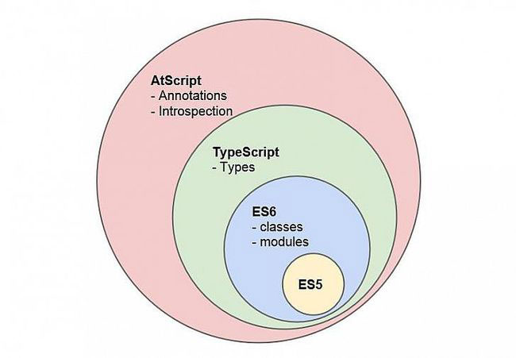

# Decorators & metadata reflection in TypeScript: From Novice to Expert (Part I)

# TypeScript 中的 Decorator & 元数据反射：从小白到专家（部分 I）

原文：[http://blog.wolksoftware.com/decorators-reflection-javascript-typescript](http://blog.wolksoftware.com/decorators-reflection-javascript-typescript)

**An in-depth look to the TypeScript implementation of decorators and how they make possible new exciting JavaScript features like reflection or dependency injection**.

**深入探寻 TypeScript 的 decorator 实现，发现它们是如何为 JavaScript 添加令人兴奋的特性，比如反射和依赖注入**。

This series will cover:

这个系列包含4篇文章：

- PART I: Method decorators
- PART II: Property decorators & Class decorators
- PART III: Parameter decorators & Decorator factory
- PART IV: Types serialization & The metadata reflection API

- **部分 I：方法注解**
- **部分 II：属性注解与类注解**
- **部分 III：参数注解与注解工厂**
- **部分 IV：类型的序列化与元数据放射 API**

A few months ago Microsoft and Google announced that they were working together on TypeScript and Angular 2.0

几个月以前，Microsoft 和 Google 一起宣布说他们就 TypeScript 和 Angular 2.0 的开发达成合作。

> We’re excited to announce that **we have converged the TypeScript and AtScript languages**, and that Angular 2, the next version of the popular JavaScript library for building web sites and web apps, will be developed with TypeScript.

## Annotations & decorators

## Annotation & Descorator

This partnership has helped TypeScript to evolve additional language features among which we will highlight [annotations](https://github.com/Microsoft/TypeScript/issues/1557).

这次合作有助于 TypeScript 吸收更多的语言特性，例如我们这次要说的[注解](https://github.com/Microsoft/TypeScript/issues/1557)。

> **Annotations, a way to add metadata to class declarations for use by dependency injection or compilation directives**.

Annotations was an proposed by the Google AtScript team but annotations are not a standard. However, decorators are a proposed standard for ECMAScript 7 by Yehuda Katz, to annotate and modify classes and properties at design time.

注解功能是 Google [AtScript](https://docs.google.com/document/d/11YUzC-1d0V1-Q3V0fQ7KSit97HnZoKVygDxpWzEYW0U/edit)https://docs.google.com/document/d/11YUzC-1d0V1-Q3V0fQ7KSit97HnZoKVygDxpWzEYW0U/edit 团队提出的，但并不是语言标准的一部分。然而，[Yehuda Katz 已经把 Decorator 已经作为了 ECMAScript 7 的一项提案](https://github.com/wycats/javascript-decorators)。可以用来在开发的时候注解和修改类和属性。

Annotation and decorator are pretty much the same:

Annotation 和 Decorator 几乎是一样的：

> Annotations and decorators are nearly the same thing. From a consumer perspective we have exactly the same syntax. The only thing that differs is that we don’t have control over how annotations are added as meta data to our code. Whereas decorators is rather an interface to build something that ends up as annotation.

Over a long term, however, we can [just focus on decorators, since those are a real proposed standard](https://github.com/google/traceur-compiler/issues/1644). AtScript is TypeScript and TypeScript implements decorators.

很长一段时间以来，我们都把注意力放在 Decorator 上，毕竟已经成为了一个草案提出来了。AtScript 本质上就是 TypeScript 加上 TypeScript 实现的 Decorator。

Let’s take a look to the TypeScript’s decorators syntax.

一起来看一下 TypeScript 的 Decorator 语法。

Note: If you want to learn more about the difference between Annotations and Decorators there is a great article by Pascal Precht on this topic.

注意：如果你想了解更多关于 Annotation 和 Decortator 的区别，可以看看 [Pascal Precht 写的这篇文章](http://blog.thoughtram.io/angular/2015/05/03/the-difference-between-annotations-and-decorators.html)。

## Decorators in TypeScript

## TypeScript 中的 Decorator

In the TypeScript source code we can find the signature of the available types of decorators:

在 [TypeScript 的源码中](https://github.com/Microsoft/TypeScript/blob/master/src/lib/core.d.ts#L1168-L1171)我们可以找到支持的 Decorator 类型的定义：

    declare type ClassDecorator = <TFunction extends Function>(target: TFunction) => TFunction | void;

    declare type PropertyDecorator = (target: Object, propertyKey: string | symbol) => void;

    declare type MethodDecorator = <T>(target: Object, propertyKey: string | symbol, descriptor: TypedPropertyDescriptor<T>) => TypedPropertyDescriptor<T> | void;

    declare type ParameterDecorator = (target: Object, propertyKey: string | symbol, parameterIndex: number) => void;

As we can see, decorators can be used to annotate a class, property, method or parameter. Let’s take a in-depth look to each one of these types of decorators.

可以看到，Decorator 可以被用来注解 `class`、`property`、`method`和 `parameter`。接下来我们深入看看不同类型的 Decorator。

## Method decorators

## Method decorator

Now that we know how the signature of a decorator looks like we can implement some of them. We are going to start by implementing a method decorator. Let’s create a method decorator named log.

现在，我们已经知道了可实现的 Decorator 是什么样子，让我们从实现一个方法 Decorator 开始，创建一个名为 `log` 的**方法 Decorator**。

To invoke a method decorator we need to prefix the method that we wish to decorate with the @ character follow by the name of the decorator. In the case of a decorator named log, the syntax will look as follows:

要使用 Decorator，需要把注解放在被注解的方法前面，使用 `@` 字母加上注解的名字。就如 `log` 注解，使用起来就像下面这样：

    class C {
        @log
        foo(n: number) {
            return n * 2;
        }
    }

Before we can actually use @log we need to declare the method decorator somewhere in our application. Let’s take a look to the log method decorator implementation.

在使用 `@log` 之前，需要现在应用的某个地方定义这个方法。因此先来看看 `log` **方法 Decorator** 的实现。

    function log(target: Function, key: string, value: any) {
        return {
            value: function (...args: any[]) {
                var a = args.map(a => JSON.stringify(a)).join();
                var result = value.value.apply(this, args);
                var r = JSON.stringify(result);
                console.log(`Call: ${key}(${a}) => ${r}`);
                return result;
            }
        };
    }

Note: Please take a look to updates at the end of this post for an alternative implementation, which a avoids one potential issue.

注意：可以看看文章最后关于这个方法的另外一种实现，可以避免一些潜在的问题。

A method decorators takes a 3 arguments:

一个**方法 Decorator** 接受三个参数：

target the method being decorated.
key the name of the method being decorated.
value a property descriptor of the given property if it exists on the object, undefined otherwise. The property descriptor is obtained by invoking the Object.getOwnPropertyDescriptor() function.

- `target`：被注解的方法；
- `key`：被注解方法的名字；
- `value`：属性的描述，如果这个属性存在于一个对象上的话，否则就是 `undefined`。属性描述，可以通过 `[Object.getOwnPropertyDescriptor()](https://developer.mozilla.org/en-US/docs/Web/JavaScript/Reference/Global_Objects/Object/getOwnPropertyDescriptor)` 函数获得。

There is something strange right? We didn’t pass any of these parameters when we used the decorator @log in the C class definition. At this point we should be wondering who is providing those arguments? and Where is the log method being invoked?

有点怪异？在我们使用 `@log` 来注解 C 类的定义，并没有传递任何的参数。**这个时候我们又搞不清楚是谁传的参数，又是谁调用了 `log` 函数**？

We can find the answers to these questions by examining the code that the TypeScript compiler will generate for the code above.

我们可以从 TypeScript 编译器编译后的代码中找到答案：

    var C = (function () {
        function C() {
        }
        C.prototype.foo = function (n) {
            return n * 2;
        };
        Object.defineProperty(C.prototype, "foo",
            __decorate([
                log
            ], C.prototype, "foo", Object.getOwnPropertyDescriptor(C.prototype, "foo")));
        return C;
    })();

Without the @log decorator the generated JavaScript for the C class would just be as follows.

去掉 `@log` Decorator 的话，编译 `C` 类后的代码如下：

    var C = (function () {
        function C() {
        }
        C.prototype.foo = function (n) {
            return n * 2;
        };
        return C;
    })();

But when we add the @log decorator the following additional code is added to the class definition by the TypeScript compiler.

但是在添加了 `@log` Decorator 之后，TypeScript 编译器在类的定义中加入了如下额外的代码：

    Object.defineProperty(
      __decorate(
        [log],                                              // decorators
        C.prototype,                                        // target
        "foo",                                              // key
        Object.getOwnPropertyDescriptor(C.prototype, "foo") // desc
      );
    );

If we read the MDN documentation we will learn that the following about the defineProperty function.

阅读 [MDN 文档](https://developer.mozilla.org/en/docs/Web/JavaScript/Reference/Global_Objects/Object/defineProperty)，可以知道一些关于 `DefineProperty` 函数的知识：

> The Object.defineProperty() method defines a new property directly on an object, or modifies an existing property on an object, and returns the object.

The TypeScript compiler is passing the prototype of C, the name of the method being decorated (foo) and the return of a function named __decorate to the defineProperty method.

TypeScript 编译器将 C 类的 `prototype`、被注解函数的名称以及名为 `__decorate ` 的返回值作为参数传递给 `defineProperty` 函数。

The TypeScript compiler is using the defineProperty method to override the method being decorated. The new method implementation will be the value returned by the function __decorate. By now we should have a new question: Where is the __decorate function declared?

TypeScript 借助 `defineProperty` 函数来重载被注解方法。`_decorate ` 的返回值作为新的实现方法。现在我们就有了新的疑问：**`_decorate` 函数做了什么**？ 

If you have work before with TypeScript you may already know that when we use the extends keyword a function named __extends is generated by the TypeScript compiler.

熟悉 TypeScript 的童鞋应该知道在我们使用 `extend` 时，TypeScript 编译器会产生一个 `__extends ` 函数。

    var __extends = this.__extends || function (d, b) {
        for (var p in b) if (b.hasOwnProperty(p)) d[p] = b[p];
        function __() { this.constructor = d; }
        __.prototype = b.prototype;
        d.prototype = new __();
    };

In a similar manner, when we use a decorator a function named __decorator is generated by the TypeScript compiler. Let’s take a look to the __decorator funcion.

同样的方式，当我们使用注解时，TypeScript 编译器就会产生一个 `__decorator` 函数。我们一起近距离看看这个函数：

    var __decorate = this.__decorate || function (decorators, target, key, desc) {
      if (typeof Reflect === "object" && typeof Reflect.decorate === "function") {
        return Reflect.decorate(decorators, target, key, desc);
      }
      switch (arguments.length) {
        case 2:
          return decorators.reduceRight(function(o, d) {
            return (d && d(o)) || o;
          }, target);
        case 3:
          return decorators.reduceRight(function(o, d) {
            return (d && d(target, key)), void 0;
          }, void 0);
        case 4:
          return decorators.reduceRight(function(o, d) {
            return (d && d(target, key, o)) || o;
          }, desc);
      }
    };

The first line in the code snippet above is using an OR operator to ensure that if the function __decorator is generated more than once it will not be override again and again. In the second line, we can observe a conditional statement:

这段代码的第一行，使用一个 OR 操作符来确保 `__decorator` 最多被定义一次，不会一次一次地被复写。第二行，是一个条件语句：

if (typeof Reflect === "object" && typeof Reflect.decorate === "function")

The conditional statement is used to detect an upcoming JavaScript feature: The metadata reflection API.

这个条件语句用来检测将会被加入 JavaScript 的新特性：[**元数据反射 API**](https://github.com/jonathandturner/decorators/blob/master/specs/metadata.md)。

Note: We will focus on the metadata reflection API towards the end of this post series so let’s ignore it for now.

**注意：在本系列的最后一篇文章中，我们会详细介绍元数据反射 API，这里先略过不表**。

Let’s remember how did we get here for a second. The method foo is about to be override by the return of the function __decorate which was invoked with the following parameters.

花点时间看看我们现在到哪里了。`__decorate` 以下面的参数被调用，使用返回值来重载方法 `foo`。

    __decorate(
      [log],                                              // decorators
      C.prototype,                                        // target
      "foo",                                              // key
      Object.getOwnPropertyDescriptor(C.prototype, "foo") // desc
    );

We are now inside the __decorate method and because the metadata reflection API is not available, a fallback is about to be executed.

`__decorate` 方法中，由于元数据反射 API 不可用，将会执行后面的 fallback 代码。

    // arguments.length === number fo arguments passed to __decorate()
    switch (arguments.length) {
      case 2:
        return decorators.reduceRight(function(o, d) {
          return (d && d(o)) || o;
        }, target);
      case 3:
        return decorators.reduceRight(function(o, d) {
          return (d && d(target, key)), void 0;
        }, void 0);
      case 4:
        return decorators.reduceRight(function(o, d) {
          return (d && d(target, key, o)) || o;
        }, desc);
    }

Because 4 parameters are passed to the __decorate method, the case 4 will be executed. Understanding this piece of code can be a challenge because the name of the variables are not really descriptive but we are not scared of it right?

因为传递了 4 个参数给 `__decorate`，所以 `case 4` 将被调用。要理解这段代码似乎有点难度，因为变量的名称是无意义的，但应该不会唬住我们。

Let’s start by learning about the reduceRight method.

先看研究下 `reduceRight` 方法。

> The reduceRight method applies a function against an accumulator and each value of the array (from right-to-left) has to reduce it to a single value.

> `reduceRight` 方法使用一个累加器方法作用在一个数组上，从右到左，一项一项地将它归纳成一个值。

The code below performs the exact same operation but it had been rewritten to facilitate its understanding

下面的代码本身的逻辑没有变化，只是重写了下，便于理解：

    [log].reduceRight(function(log, desc) {
      if(log) {
        return log(C.prototype, "foo", desc);
      }
      else {
        return desc;
      }
    }, Object.getOwnPropertyDescriptor(C.prototype, "foo"));

When the code above is executed the decorator log is invoked and we can see that some parameters are passed to it: C.prototype,"foo" and previousValue. So we have finally answered our original questions:

上面的代码开始执行时，注解 `log` 将被调用。可以看到传递给它的参数：`C.prototype`，`"foo"` 以及 `previousValue`。因此我们回答除了自己提的问题：

- Who is providing those arguments?
- Where is the log method being invoked?

- 这些参数是谁提供的？
- `log` 函数是在哪里调用的？

If we return to the log decorator implementation we will be able to understand much better what happens when it is invoked.

现在如果回到 `log` 注解的实现，我们很容易理解当它被调用时发生了什么。

    function log(target: Function, key: string, value: any) {

        // target === C.prototype
        // key === "foo"
        // value === Object.getOwnPropertyDescriptor(C.prototype, "foo")

        return {
            value: function (...args: any[]) {

                // convert list of foo arguments to string
                var a = args.map(a => JSON.stringify(a)).join();

                // invoke foo() and get its return value
                var result = value.value.apply(this, args);

                // convert result to string
                var r = JSON.stringify(result);

                // display in console the function call details
                console.log(`Call: ${key}(${a}) => ${r}`);

                // return the result of invoking foo
                return result;
            }
        };
    }

After decorating the foo method it will continue to work as usually but it will also execute the extra logging functionality added by the log the decorator.

`foo` 注解之后也是正常执行，只是还会额外运行 log 的功能，这些功能是由 `log` 注解添加的。

    var c = new C();
    var r = c.foo(23); //  "Call: foo(23) => 46"
    console.log(r);    // 46

## Conclusions

## 总结

It has been a journey right? I hope you have enjoyed as much as I have. We are just getting started but we already know enough to create some truly awesome stuff.

一段美妙的旅途，不是吗？我希望你如我一样享受。我们才刚刚启程，就获得了足够的知识来创造真正有意义的东西。

Method decorators can be used for many interesting features. For example, If you have ever worked with spies in testing frameworks like SinonJS you will probably get excited when you realize that decorators are going to allow us to do things like create spies by just adding a @spy decorator.

方法注解可以用在很多有意思的特性之中。例如，如果你曾今使用过[测试框架框架中（例如 SinonJS）的 spy 组件](http://sinonjs.org/docs/#spies)，一定会兴奋不已。因为注解允许我们通过 `@spy` 这样的注解来创建 `spy`。

In the next chapter of this series we will learn how to work with Property decorators. Don’t forget to subscribe if you don’t want to miss it out!

在下一小节中，我们将学习如何使用 **Property Decorator**。为么不错过新的文章，别忘了加关注。

If you have enjoyed this article please check out The end of JavaScript? in which I discuss how the arrival of metadata annotations could mean the end of plain JavaScript as a design-time programming language.

如果你对本文感兴趣，还可以看看 [The end of JavaScript?](http://blog.wolksoftware.com/the-end-of-javascript) 在这片文章中，我探讨了元数据注解的到来也就意味着 JavaScript 做为设计开发语言的终结。

Please feel free to talk about this article with us via @OweR_ReLoaDeD and @WolkSoftwareLtd

欢迎通过 [@OweR_ReLoaDeD](https://twitter.com/OweR_ReLoaDeD) 和 [@WolkSoftwareLtd](https://twitter.com/WolkSoftwareLtd) 与我们交流。

## Updates

## 更新

There has been some changes in the original content due to issues. Please if you have spot any problems let me know at @OweR_ReLoaDeD and I will post updates here.

本已经已经对一些错误进行了修正。如果你发现任何问题，请通过 [@OweR_ReLoaDeD](https://twitter.com/OweR_ReLoaDeD) 联系我，我会更新在这里。

### 20 May 2015

## 2015年5月20号

In the original article an arrow function => inside the log decorator was used. The arrow function interferes with the value of this in value.value.apply(this, args), which ought to be passed straight through unchanged.

在原来的文章中，`log` 注解中使用了一个 `=>` 函数。**箭头函数干扰了 `value.value.apply(this, args)` 中的 `this` 的值**，由于并没有什么变化，直接传递即可。

It is also recommended editing the descriptor/value parameter and return that instead of overwriting it by returning a new descriptor. So we keep values currently in the descriptor and won’t overwrite what another decorator might have done to the descriptor.

同时，有人认为比返回一个新值覆盖原来的值更好的做法是，编辑 `descriptor/value` 参数作为返回值。因此**我们暂存了 `descriptor` 中当前 `value`，避免覆盖其他注解对这个 `descriptor` 可能的修改**。

    function log(target: Function, key: string, descriptor: any) {

      // save a reference to the original method
      // this way we keep the values currently in the
      // descriptor and don't overwrite what another
      // decorator might have done to the descriptor.
      var originalMethod = descriptor.value;

      //editing the descriptor/value parameter
      descriptor.value =  function (...args: any[]) {
          var a = args.map(a => JSON.stringify(a)).join();
          // note usage of originalMethod here
          var result = originalMethod.apply(this, args);
          var r = JSON.stringify(result);
          console.log(`Call: ${key}(${a}) => ${r}`);
          return result;
      }

      // return edited descriptor as opposed to overwriting
      // the descriptor by returning a new descriptor
      return descriptor;
    }

Please check out this stack-overflow answer for more details about both issues.

请参看 [Stack-Overflow 上的答案](http://stackoverflow.com/questions/30329832/how-to-avoid-hard-coded-this-in-decorators#answer-30330602) 了解上面两个问题的更多信息。
