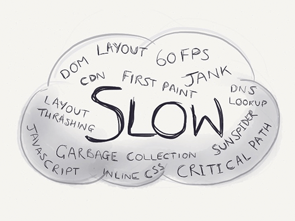

原文链接：[Introducing RAIL: A User-Centric Model For Performance](http://www.smashingmagazine.com/2015/10/rail-user-centric-model-performance/#a-note-on-measurement)

> 译者注：本篇将使用视频资源，需要大家采用正确的姿势阅读哦。

# Introducing RAIL: A User-Centric Model For Performance
# RAIL，以用户为核心的性能模型

There’s no shortage of **performance advice**, is there? The elephant in the room is the fact that it’s **challenging to interpret**: Everything comes with caveats and disclaimers, and sometimes one piece of advice can seem to actively contradict another. Phrases like “The DOM is slow” or “Always use CSS animations” make for great headlines, but the truth is often far more nuanced.

难道**对性能提建议**还能有不好吗？但其实我们都在**回避这个问题的答案**：每条优化建议的后面都跟着警告和免责声明，有时候这些建议还是相互矛盾的。像“ DOM 太慢了”或者“尽可能地使用 CSS 动画”这样的大标题之下，掩盖着的实际场景要复杂的多。

Take something like loading time, the most common performance topic by far. The problem with loading time is that some people measure Speed Index, others go after first paint, and still others use body.onload, DOMContentLoaded or perhaps some other event. It’s rarely consistent. When it comes to other ways to measure performance, you’ve probably seen enough JavaScript benchmarks to last a lifetime. You may have also heard that 60 FPS matters. But when? All the time? Seems unrealistic.

现在最常见的性能话题大概就是“加载时间”吧，就拿它来举例。有人用 [Speed Index](https://sites.google.com/a/webpagetest.org/docs/using-webpagetest/metrics/speed-index) 作为衡量的标准；有人以页面首次绘制时间为准；仍有人使用 ```body.onload``` 或者 ```DOMContentLoaded``` 或者别的事件为准。衡量的标准并不统一。还有其他方法可以衡量性能，比如你已经看腻了用 JavaScript 基准（JavaScript benchmark）延续页面的生命周期。你可能也听过60 FPS。但是这些标准适用在什么场合？任何时间点吗？听起来有点不现实啊。

Very few of us have unlimited time to throw at optimization work, far from it, and we need criteria that help us decide what’s important to optimize (and what’s not!). When all is said is done, we want and need clear guidance on what “performant” means to our users, because that’s who we’re building for.

我们当中几乎没有人可以把时间完全投入在优化上，所以我们需要一个标准来告诉我们现在要去优化什么东西（或者什么东西暂时不需要优化了）。该说的都说了，现在我们需要一个明确的指引告诉开发者，**在用户的眼里**“性能”意味着什么，毕竟用户才是我们最终服务的对象。


On the Chrome team, we’ve been thinking about this, and we’ve come up with a model to put the user right back in the middle of the performance story. We call it the RAIL model.

Chrome 团队已经考虑过这个问题，并提出了 **RAIL** 模型。用户在这个性能模型中扮演了很重要的角色。

If you want the TL;DR on RAIL to share with your team, here you go!

如果你迫不及待想要把 **RAIL** 分享给你的团队，那可以说说这些：

+ RAIL is a model for breaking down a user’s experience into key actions (for example, tap, drag, scroll, load).
+ [RAIL](http://www.smashingmagazine.com/2015/10/rail-user-centric-model-performance/#rail-perf-model) 将用户体验根据关键动作（比如，轻触、拖拽、滚动、加载）分割到了不同的模块中。

+ RAIL provides performance goals for these actions (for example, tap to paint in under 100 milliseconds).
+ RAIL 给这些动作制定了[性能目标](http://www.smashingmagazine.com/2015/10/rail-user-centric-model-performance/#rail-perf-goals)（比如，轻触后的绘制要在100毫秒之内完成）。

+ RAIL provides a structure for thinking about performance, so that designers and developers can reliably target the highest-impact work.
+ RAIL 提供了一个思考性能问题的结构，所以当设计师和开发者想要处理对用户影响最大的问题的时候有法可依。

Before diving into what RAIL involves and how it could be helpful in your project, let’s step back and look at where it comes from. Let’s start with every performance-minded person’s least favorite word in the whole wide world: “slow.”

在讲如何运用 RAIL 以及如何使用它辅助你的项目时，让我们先看看这个模型是怎么来的。就从大家都很讨厌的词“慢”，开始吧。

## “Slow”
## “慢”

Is changing the DOM slow? What about loading a ```<script>``` in the ```<head>```? JavaScript animations are slower than CSS ones, right? Also, does a 20-millisecond operation take too long? What about 0.5 seconds? 10 seconds?

改变 DOM 结构会拖慢性能？如果在 ```<head>``` 标签中添加 ```<script>```，让脚本一开始就被加载呢？JavaScript 动画比 CSS 动画要慢。一个操作要用20毫秒会不会太慢了？0.5秒呢？10秒呢？



While it’s true that different operations take different amounts of time to complete, it’s hard to say objectively whether something is slow or fast without the context of when it’s happening. For example, code running during idle time, in a touch handler or in the hot path of a game loop each has different performance requirements. Put another way, the people using your website or app have different **performance expectations** for each of those contexts. Like every aspect of UX, we build for our users, and what they perceive is what matters most. In fact, number one on [Google’s ten things we know to be true](http://www.google.com/about/company/philosophy/) is “Focus on the user and all else will follow.”

不同的操作需要的完成时间长短不一，这是肯定的。脱离内容谈加载速度都是耍流氓。举个例子，在浏览器空闲的时间里，代码在 touch 句柄和游戏循环（game loop）中的主线路径的性能要求应该是不同的。换言之，用户的**性能期望**会根据产品的内容不同而不同。我们为用户体验所做的一切能不能被终端用户感知到，才是最重要的。事实上，在 [Google’s ten things we know to be true](http://www.google.com/about/company/philosophy/) 这篇文章中第一条就是“聚焦于用户，则一切将水到渠成”。

Asking **“What does slow mean?,”** then, is really the wrong question. Instead, we need to ask “What does the user feel when they’re interacting with the things we build?”

不要再问“‘慢’意为着什么”了，而应该问“当用户与产品交互时，用户的感受是怎样的”。

## Putting The User In The Center Of Performance
## 以用户为核心，考虑性能

Luckily for us, there’s long-standing academic HCI research on this topic, and you may have seen it before in Jakob Nielsen’s work on response time limits. Based on those thresholds, and adding an extra one for animations (because it’s 2015 and we all love a bit of showbiz), we get the following:

在人机交互领域（HCI）有一个长期的研究项目就是针对这个问题的，你可以从 [Jakob Nielsen 的研究成果](http://www.nngroup.com/articles/response-times-3-important-limits/)中得到一些结论。基于研究成果中的临界值，再加上现在最受欢迎的动画效果，我们得到以下结论：

+ **100 milliseconds**：Respond to a user action within this time window and they will feel like the result is immediate. Any longer and that connection between action and reaction breaks.
+ **100 毫秒**：用户采取操作后，要在100毫秒内收到反馈，才不会有延迟感。

+ **1 second**: Within this window, things feel part of a natural and continuous progression of tasks. Beyond it, the user will lose focus on the task they were performing. For most users on the web, loading a page or changing views represents a task.
+ **1 秒**：在当前时窗中，物体要显得自然又有整体性。超过了1秒，用户对当前任务的会失去耐心。对于 web 中的大部分用户而言，加载页面或者改变视图就需要在1秒内完成。

+ **16 milliseconds**：Given a screen that is updating 60 times per second, this window represents the time to get a single frame to the screen (Professor Math says 1000 ÷ 60 = ~16). People are exceptionally good at tracking motion, and they dislike it when their expectation of motion isn’t met, either through variable frame rates or periodic halting.
+ **16 毫秒**：屏幕一秒钟渲染60次，所以每一帧渲染到屏幕上至多16毫秒（1000毫秒/60 ~= 16）。人们本能地会跟随运动，当动画帧出现中断或者卡顿，我们常常会觉得不爽。

These perception thresholds are great because they give us the building blocks we need. What we need to do next is map them to reality. Let’s consider a typical interaction that our users have:

有了这些阀值，我们就有了参考的标准，下一步就是将这些值映射到开发中。现在让我们来考虑以下应用场景：


In that brief session were a number of distinct interactions:

以上场景里，用户做了这些事情：

+ waiting for the page to load,
+等待页面加载完成，

+ watching an animation,
+ 观看酷炫的动画，

+ scrolling the page,
+ 滚动页面，

+ tapping an icon,
+ 轻触图标，

+ watching the navigation animate open,
+ 观看导航栏展开的动画，

+ waiting for the page to load,
+ 等待页面加载完成，

+ watching an animation,
+ 观看动画，

+ scrolling the page.
+ 滚动页面。

Labeling those actions from the video would give us something like this:

给用户的刚刚采取的动作用色块做记号，然后得到下面这张图：


Each of those color blocks represents a type of action, and you can see that there are four of them. And there are four letters in RAIL. Curious.

每个色块代表一个动作，你可以观察到一共有**4**个色块也就是**4**个动作。emmm，RAIL 也是**4**个字母呢，美妙的巧合。

Here’s another user journey that we can break down and label, this time from Voice Memos:

让我们再来看一个视频，感受一下交互过程吧：


We can break down user interactions and categorize them into four distinct areas. At Google, we call these areas RAIL, and each comes with its own performance goals, which are based on the human perception thresholds we just saw.

我们可以把交互的过程分成4个独立的模块。在 Google，我们将这些模块称为 RAIL，每个模块都是它们的性能目标，这些目标也是基于我们刚刚介绍过的阀值。

;

## The RAIL Performance Model
## RAIL 性能模型

RAIL stands for response, animation, idle and load.

RAIL 是 response （响应）、 animation（动画）、idle（浏览器空置状态）和 load（加载）。

These four distinct areas are a way to reason about the actions in your websites and apps. If you optimize based on each area’s performance goals (which we got from those perception thresholds), then your users will be very happy.

从这四个模块角度来思考你的产品。如果在每个模块上，你都可以达到性能优化的目标值（也就是上文提及的阀值），那么最终用户感受到的将会是极致的体验。


Let’s look at each one in detail.

现在让我们一个个来看。

1. **Response**

If a user clicks on a button, you have to respond to their click before they notice any lag. This applies to any input, really, whether it’s toggling a form control or starting an animation. If it doesn’t happen in a reasonable window of time, then the connection between action and reaction breaks and the user will notice.

如果用户点击了一个按钮，你需要保证在用户察觉出延迟之前就得到反馈。无论是表单控制还是执行动画，只要有输入，这个原则都适用。如果没有在合理的时窗内完成响应，也就是***采取动作和得到响应之间出现了断层**，用户将会察觉到这个延迟。

Response is all about input latency: the lag between the finger touching the glass and the resulting pixels hitting the screen. Have you ever tapped on something and it took so long to respond that you started wondering whether it registered your tap? That’s exactly the kind of thing we want to avoid!

响应的速度根本上来说取决于输入的延迟，输入的延迟存在于：指甲触到屏幕玻璃和实际像素到达屏幕之间。你有没有过这样的经历：轻触到某种东西，结果它没有给出任何反应，接着你就会质疑自己那个东西是否真的接收到你的轻触。这种自我怀疑的场景就是我们想要避免的！

Response’s primary interaction is:

响应的主要交互是：

+ tapping — when the user taps or clicks on a button or icon (for example, tapping a menu icon to open off-screen navigation).
+ **tapping（轻触）** -- 当用户轻触或者点击一个按钮或者图标时（比如，轻触菜单图标打开一个抽屉导航）。

To respond responsively, we would:

要得到响应式的回应，我们需要：

+ provide feedback in less than 100 milliseconds after initial input.
+ 在首次收到输入时，在100毫秒内得到回应。

+ Ideally, the feedback would show the desired state. But if it’s going to take a long time, then a loading indicator or coloring for the active state will do. The main thing is to acknowledge the user so that they don’t start wondering whether their tap was registered.
+ 理想情况下，收到的回应就是最终结果。但如果最终结果还需要花更长的时间得到，那也要给用户一个“加载中”的标识，或是颜色的变更，告诉用户“本产品已经接收到了指令，还在处理中”，不至于让用户自我怀疑。

2. **Animation**

Animation is a pillar of modern apps, from scrolling to view transitions, and we must be judicious with what we do in this period of time, because the user will often be interacting directly and will really notice if the frame rate varies. However, the user expects very smooth feedback for more than what falls under the classic definition of animation.

动画现在是应用的一大支柱，从滚动到视图变化，都有动画的身影。我们要明确在这段时间里能做些什么，因为用户可能常常是直接操作，帧率的改变很容易被察觉到。但是用户想要的只是流畅的响应而已。

Animation includes the following:
动画包含了以下概念：

+ **visual animation**
+ **视觉动画**

This includes entrance and exit animations, tweened state changes, and loading indicators.
这个包括了动画的开始和退出，状态改变时的动画，还有加载标识。

+ **scrolling**
+ **滚动**

This refers to when the user starts scrolling and lets go and the page is flung.
当用户开始滚动页面，页面出现猛动的情况。

+ **drag**
+ **拖拽**

While we need to respond to the user’s interaction in under 100 milliseconds, animation might follow as a result, as when panning a map or pinching to zoom.
当我们需要对用户的拖拽交互在100毫秒以内做出响应时，比如平移地图或者缩放屏幕时，我们需要依赖动画。

To animate properly, each frame of animation should be completed in less than 16 milliseconds, thereby achieving 60 FPS (1 second ÷ 60 = 16.6 milliseconds).
要合理地动画，每一帧动画要**在16毫秒内完成**，才能达到60FPS（1000ms/60 ~= 16.6 ms）。

3. **IDLE**

Creating apps that respond and animate well often requires deferment of work. The Optimistic UI patterns leverage this technique to great effect. All sorts of work that must be completed likely does not need to happen within a critical time window in the same way as “response” or “load”: Bootstrapping the comments functionality, initializing components, searching and sorting data, and beaconing back analytics data are all non-essential items that we can do when the browser is idle.

要制作响应迅速动画精良的应用通常需要比较长的工时。[Optimistic UI](http://info.meteor.com/blog/optimistic-ui-with-meteor-latency-compensation)模式利用这个技术达到了很好的效果。所有

To use idle time wisely, the work is grouped into blocks of about 50 milliseconds. Why? Should a user begin interacting, we’ll want to respond to them within the 100-millisecond response window, and not be stuck in the middle of a 2-second template rendering.

4. **LOAD**

Page-loading time is a well-trodden area of performance. We’re most interested in getting the user to the first meaningful paint quickly. Once that’s delivered, the app must remain responsive; the user mustn’t encounter trouble when scrolling, tapping or watching animations. This can be super-challenging, especially when much of the work for a page shares a single thread.

To load pages quickly, we aim to deliver the first meaningful paint in under 1 second. Beyond this, the user’s attention starts to wander and the perception of dealing with the task at hand is broken. Reaching this goal requires prioritizing the critical rendering path and often deferring subsequent non-essential loads to periods of idle time (or lazy-loading them on demand).
