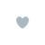
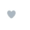
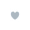
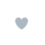
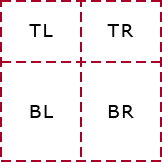
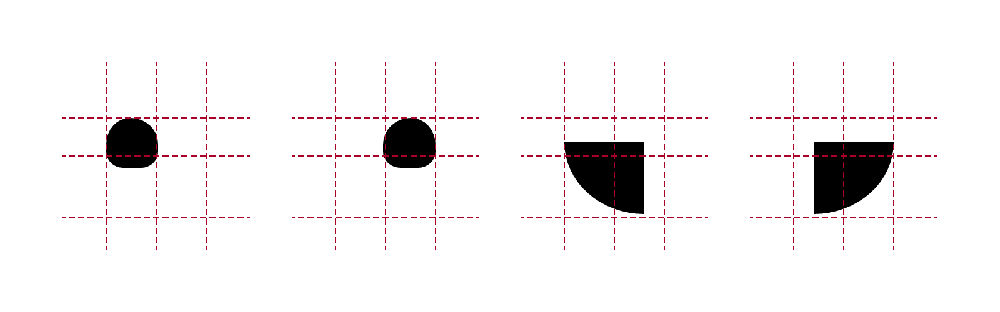
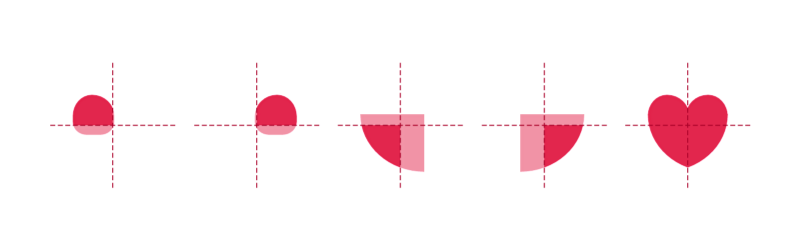
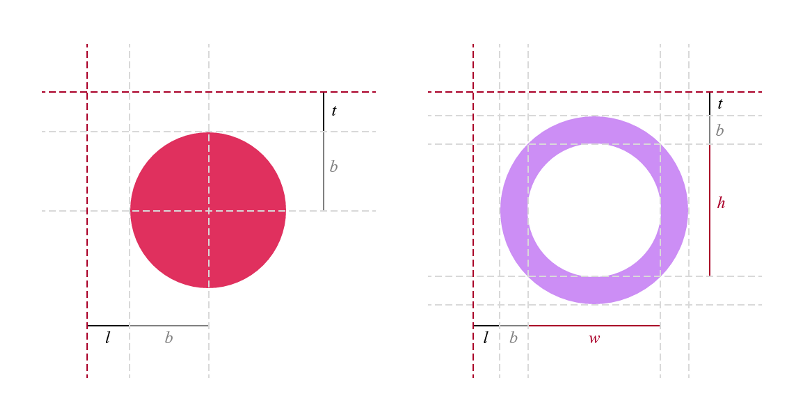
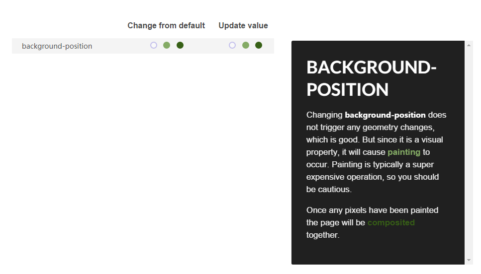

# Twitter "赞" 动画实战


原文1地址：[Twitter’s Heart Animation in Full CSS](https://medium.com/@OxyDesign/twitter-s-heart-animation-in-full-css-b1c00ca5b774#.pndd8brke)  

原文2地址：[How Did They Do That? The Twitter “Like” Animation.](https://medium.com/@chrismabry/how-did-they-do-that-the-twitter-like-animation-2a473b658e43#.amz1n79v0)

> 译者的话：Twitter 的 '赞' 效果相信不少人已经发现了，Medium 上有两位开发者模拟了这个效果。今天这篇文章是那两位开发者文章的译文综合，文中间或夹杂译者对实现方式的思考，请轻拍。


不知道你有没有留意到，Twitter 已经不再使用星星动画做“收藏”的效果，现在用的是爱心版的“赞”。不管大家对此有何评价，今天我们要来模拟的就是这个效果了。


[Chris Mabry](https://medium.com/@chrismabry) 通过更改 CSS 雪碧图 ```background-position``` 的值实现了这个动画；[Nicolas Escoffier](https://medium.com/@OxyDesign) 是用 SASS 实现，不过也参考了雪碧图的方案。现在先让我们看看雪碧图的方式吧。


雪碧图动画的原理来自游戏领域，通常译者称之为定格动画，因为是一帧一帧变化的。读者也可以套用走马灯的原理。


为什么不直接使用单张图片呢？为了减少请求数。服务器端和客户端之间的传输成本很高，如果你的产品有320万活跃用户，即使只是减少几个请求数，性能也能得到非常大的优化。“赞”动画被我们分成了29帧，用雪碧图的方式可以将请求数从29减少到1。


所以我们要先合成出一张长长长的雪碧图。


现在来个三步走，就能实现这个效果了：

1. 有一个 ```div``` 放爱心，这个 ```div``` 的背景图就是上面那张雪碧图。
2. 构建一个 ```keyframe```  执行 ```background-position``` 动画，让背景图的位置从左移动到右。
3. 当用户点击的时候，触发这个动画。


首先，要有一个 ```div```:

``` html
<div class=”heart”></div>
```


还要有对应的样式

``` css
.heart {
   cursor: pointer;
   height: 50px;
   width: 50px;
   background-image:url('https://abs.twimg.com/a/1446542199/img/t1/web_heart_animation.png');
   background-position: left;
   background-repeat:no-repeat;
   background-size:2900%;
}
```


我们给一个  ```div```  定了宽高；并将它的背景图设置为上面那张很长的雪碧图；然后将它的  ```background-position```  固定到雪碧图的最左边（动画的起始帧）```background-size```  设定为 2900%，这样可以保证雪碧图可以完全占满这个 ```div``` 。不要忘了把  ```cursor```  设置成可点击的。


接着就可以看到一个爱心图案：




用简单粗暴的方法让这颗爱心动起来的方法：


``` css
@keyframes heart-burst {
 from {background-position:left;}
 to { background-position:right;}
}
```


这个关键帧的名字叫做 heart-burst，它要执行的动画，就是将 ```background-position```  从 ```left``` 变成 ```right```。


*注意：动画需要添加浏览器前缀，保证兼容性，兼容情况请看[这里](https://css-tricks.com/snippets/css/keyframe-animation-syntax/)*


把这个动画效果加到刚刚的 ```div``` 上吧：




我知道现在的动画看着很奇怪，因为浏览器在执行序列帧动画，还记得爱心的 ```div```  背景图是一张很长的雪碧图吧，每一次我们都只能看到这个雪碧图的一部分。就好像从一个窗口往一个世界看，只能看到世界的一部分。序列帧动画就像窗口不动，背后的世界在很流畅地流动。所以你会看到流动的整个过程。


现在已经很接近最终效果咯。不过还需要 ```steps()```  来调整一下，可以通过这个函数将序列帧动画变成定格动画：

``` css
.is_animating {
  animation: heart-burst .8s steps(28) 1;
}
```


雪碧图上有29帧，所以要切换28次，也就是 ```steps(28)```，动画耗时800毫秒：




别忘了在用户点击爱心的时候，才会看到动画效果，所以我们还要绑定事件，这就交给 jQuery 了：

``` javascript
$(“.heart”).on(‘click’, function(){
  $(this).toggleClass(‘is_animating’);
});
$(“.heart”).on(‘animationend’, function(){
  $(this).toggleClass(‘is_animating’);
});
```


用户点击爱心之后，通过切换 ```is_animating``` class，来切换动画。


我们还加上了监听 ```animationed``` 事件的代码，当动画执行完毕后，```div``` 上的 ```is_animating``` class 会被移除。当我们再次点击爱心的时候，才能再看到动画。


最后的最后，要保证体验的完整，不要忘了加上 ```hover``` 态时的样式：

``` css
.heart:hover {
 background-position:right;
}
```


Done！




可以从[这里](http://codepen.io/chrismabry/pen/ZbjZEj)看到完整的代码，或者用开发者工具直接上 Twitter 看。

------------------ 不知道怎么转场， 就随便割一下------------------------


现在让我们来看看 [Nicolas Escoffier](https://medium.com/@OxyDesign) 的实现方法，这个方法很巧妙。他用 Sass 画出了这颗爱心，Escoffier 分析出这个动画分成了：爱心、环形和圆形，三个部分，在动画执行的过程中，这三个部分要不断发生变形，也就是不断计算。Escoffier 编写了一些 Sass 函数保证自动化的计算。


-------------------- 以下是译文开始 ----------------------

首先，我把这个效果分成了三个层级：爱心（```.heart```）、环形（```.ring```）以及圆形（```.circles```），接着将它们三个都放进 ```.heart-wrapper``` 这个容器中。然后分别绘制每个层级，接着实现对应的动画，最后把所有动画整合到一起。


#### 爱心

我把整个形状分成了四块矩形区域：

+ 左上和右上区域都是占总高度的 25%，总宽度的 50%
+ 左下和右下区域是占总高度的 75%，总宽度的 50%




接着在每个矩形结构中，我都使用上设置了 ```border-radius``` 值的伪元素（```:after```），尽可能地模拟每个对应部分的形状。




更改 ```color``` ，并将 ```overflow``` 设置为 ```hidden```：




#### 环形

通过设置不同的 ```border-size```、```width``` 和 ```height``` 就能画出各种各样的环形了。


#### 圆形

将一个透明的圆形元素居中，然后给它加上阴影（```shadow-box```）。


圆形的阴影值，用逗号分隔。坐标值可以通过圆规和三角函数算出来：


### 爱心动画

通过增减“爱心”元素的宽高比，并相应调整元素的 ```left``` 和 ```top``` 值，同时，不要忘了校正其他和“爱心”元素又相对位置关系的元素位置。


#### 环形动画

调整 ```border``` 的大小以及其中的圆形的尺寸，并相应调整它们的位置和颜色。




#### 圆形动画

这里用到的方法比较有技巧性，```box-shadow``` 的值要跟着元素的坐标值、元素的大小还有颜色同时变化。

比如：

``` scss
  51.85185% {
    box-shadow:
      -8.48528em -8.48528em 0 -0.83333em #a068ce,
      -8.38671em -5.44639em 0 -0.83333em #b752e1,
      1.34357em -11.92455em 0 -0.83333em #99e9c8,
      -0.97087em -9.95276em 0 -0.83333em #bae3d7,
      10.16069em -6.38438em 0 -0.83333em #d3f491,
      7.17606em -6.9645em 0 -0.83333em #dce483,
      11.3266em 3.96335em 0 -0.83333em #59c392,
      9.91926em 1.26817em 0 -0.83333em #67cd9f,
      3.96335em 11.3266em 0 -0.83333em #caadc7,
      5.19306em 8.54588em 0 -0.83333em #959ff3,
      -6.38438em 10.16069em 0 -0.83333em #ca5ed8,
      -3.44362em 9.38837em 0 -0.83333em #a975d1,
      -11.92455em 1.34357em 0 -0.83333em #c35dd1,
      -9.48718em 3.16122em 0 -0.83333em #90e0be;
    }
```


上面那段仅仅是某次变化后的值……


为了方便阅读和更改，我写了一个 Sass 函数来处理它：

``` scss
@function setBoxShadow($distance1, $distance2, $size1, $size2, $shiftAngle, $colorRatio) {
  $boxS: ();
  
  @for $i from 1 through length($circles) {
    $circle: nth($circles, $i);
    $order: $i - 1;
    $angle1: ($order * $angleBetweenCircles) + $shiftAngleBeginning;
    $angle2: $angle1 + $shiftAngle;
    $distanceRatio1: $size * $distance1;
    $distanceRatio2: $size * $distance2;
    $firstCircle: map-get($circle, first);
    $firstCircleStart: map-get($firstCircle, start);
    $firstCircleEnd: map-get($firstCircle, end);
    $secondCircle: map-get($circle, second);
    $secondCircleStart: map-get($secondCircle, start);
    $secondCircleEnd: map-get($secondCircle, end);
    
    $boxS: append($boxS,
      cos($angle1) * $distanceRatio1
      sin($angle1) * $distanceRatio1
      0
      $circleSize * $size1
      mix($firstCircleStart, $firstCircleEnd, $colorRatio)
    );

    $boxS: append($boxS,
      cos($angle2) * $distanceRatio2
      sin($angle2) * $distanceRatio2
      0
      $circleSize * $size2
      mix($secondCircleStart, $secondCircleEnd, $colorRatio)
    );
  }
  
  @return join($boxS, (), "comma");
}
```


这个方法循环读取了所有的储存在 **Sass Map** 中的圆形，然后根据元素间的距离、尺寸、偏移角度以及颜色的变化程度，两个两个地（一大小两个圆）更新 ```box-shadow``` 的值，这些值都会以**变量**的形式传入。


后面的动画和上文中的雪碧图动画大同小异，就不在这里提了，如果想要看 Sass 版的完整代码，请看[这里](http://codepen.io/OxyDesign/pen/avXVbo)。


----------------------------------- 大写的不知道怎么转场的译者 -------------------------------

在实际项目中，译者比较多用 ```background-position``` 的雪碧图动画做法，但是更改 ```background-position``` 将会引起重绘：




看了一下 Twitter 的做法：将爱心这一层用 ```position:absolute``` 的方式，脱离了文档流，保证在执行爱心动画的时候，重绘不会影响到下文。


Sass 的写法，会不断更改 ```border-radius``` 和 ```box-sizing```，虽然这个属性貌似和 ```background-position```  一样，只会引起重绘，但在实际项目中，译者发现这个属性很容易引起性能问题（特别是安卓上）。在 Escoffier 的原文评论里，也有人建议使用 ```transform: scale(x)``` 的方式。不过 ```left``` 和 ```top``` 也会被一直改变……总之性能上看，这个方法完全不可取T T。


但是 Sass 的写法还是有意思的。