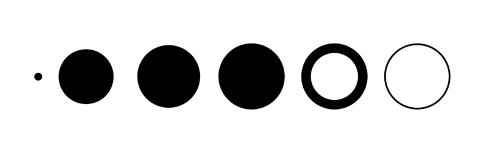
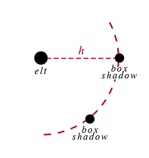
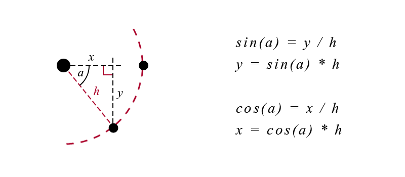
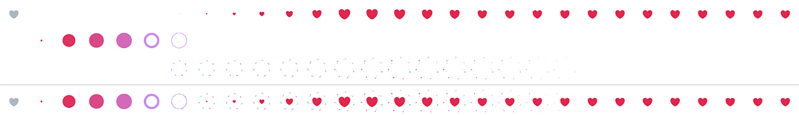

原文地址：[Twitter’s Heart Animation in Full CSS](https://medium.com/@OxyDesign/twitter-s-heart-animation-in-full-css-b1c00ca5b774#.pndd8brke) 和 [How Did They Do That? The Twitter “Like” Animation.](https://medium.com/@chrismabry/how-did-they-do-that-the-twitter-like-animation-2a473b658e43#.amz1n79v0)

> 译者的话：这篇文章我们的一种新的尝试，是译文+译者对原文的思考结合的产物，希望可以引起各位的讨论。


# How Did They Do That? The Twitter “Like” Animation.

# Twitter “喜欢” 动画教程

Or, *An Introduction to CSS Sprite Sheet Animation.*

这篇文章其实是，CSS 雪碧图动画教程。

By now, you’ve probably [seen](https://blog.twitter.com/2015/hearts-on-twitter) or [heard](http://www.wired.com/2015/11/twitter-reacts-to-hearts-replacing-stars/) — the Twitter star has been replaced with a little heart, and the “favorite” has been re-dubbed the “like.”

现在，你大概已经[见过](https://blog.twitter.com/2015/hearts-on-twitter)或者[听说](http://www.wired.com/2015/11/twitter-reacts-to-hearts-replacing-stars/)了 Twitter 把星星换成了小爱心，“收藏”也变成了“喜欢”。


Regardless of whether you love or hate the change, the new like animation is a great example of how CSS sprite sheets can be used to bring really awesome animation to the web.

不管你喜不喜欢 Twitter 的这个改变，“喜欢”可是个 CSS 雪碧图动画很好的模仿例子。


# Twitter’s Heart Animation in Full CSS

# CSS 实现Twitter 的“爱心动画”

A few weeks ago, as everybody, I saw the Twitter Star turned into a Heart. The favorite into a like.

几周前，我发现 twitter 的“喜欢”不再使用星星的图标，而是变成一颗爱心。将“最爱”变成了”喜欢“。

twitter 官方也[发推](https://blog.twitter.com/2015/hearts-on-twitter)说了这事儿

> You can say a lot with a heart. Introducing a new way to show how you feel on Twitter: https://blog.twitter.com/2015/hearts-on-twitter ... pic.twitter.com/G4ZGe0rDTP

  爱心，一种新的表达你对一条 twitter 的方式：

That was a huge source for debates for sure … but the only thing that I had in mind was … is it possible to make it with only CSS (not a single picture or SVG) ?

这一改动肯定是经过了各方拉锯，不过我关心的只是，爱心动画可不可以用 CSS 实现呢？我指的是“纯 css”，不是一张图片或者 SVG。

I know it’s not a matter of life and death but when something like that gets in my head it’s too late, I can’t sleep until I have a viable answer.

我知道这并不是一个事关生死的问题，但是既然我有了这个想法，就一定要实现出来，不然根本睡不着觉啊。

After a few trials on this challenge I finally have my answer. The result is not perfect (and it’s a lot of SCSS / CSS — almost 400 lines) but it’s satisfying (based on my expectations at least).

在经过一些尝试之后，我终于实现了。不过你可能会觉得我的代码不够漂亮，毕竟 400 行之长 SCSS/CSS 代码真的也不算回事儿嘛，不过对我来说，能找到这个方案已经很高兴了。


I will now describe the steps I went through to find it.

接下来，你会读到我的心路历程。

First I divided it in 3 layers : the Heart (.heart), the Ring (.ring) and the Circles (.circles), and grouped them in a wrapper (.heart-wrapper). After this, I made the drawing for each layer, then the animation of each layer and finally mixed them all together.

首先，我把这个效果分成了三个层级：爱心（```.heart```）、环形（```.ring```）以及圆形（```.circles```），接着将它们三个都放进 ```.heart-wrapper``` 这个容器中。然后分别绘制每个层级，接着实现对应的动画，最后把所有动画整合到一起。

## Drawing

## 绘制

### Heart

### 爱心

First part was the Heart.

首先我们要搞定的是爱心。

I separated the full area in 4 rectangles :

我把整个形状分成了四块矩形区域：

+ Top / Left and Top / Right : 25% high / 50% wide
+ 左上和右上区域都是占总高度的 25%，总宽度的 50%
+ Bottom / Left and Bottom / Right : 75% high / 50% wide
+ 左下和右下区域是占总高度的 75%，总宽度的 50%


And I used a pseudo element (:after) inside every rectangle and played with border-radius property to be as close as possible to the original shape for each part.

接着在每个矩形结构中，我都使用上设置了 ```border-radius``` 值的伪元素（```:after```），尽可能地模拟每个对应部分的形状。


Then I applied the color and overflow:hidden

接着再使用 ```color``` 和 ```overflow:hidden```：


### Ring

### 环形

The second part was the Ring.

接下来，我们要看看如何实现环形的动画。

This one is a simple rounded element with different border-size values and width / height values.

通过设置不同的 ```border-size```、```width``` 和 ```height``` 就能画出各种各样的环形了。




### Circles

### 圆形

The third part was the Circles.

第三步，圆形。

I built this one using a transparent rounded element in the middle and adding shadow boxes on it.

将一个透明的圆形元素居中，然后给它加上阴影（```shadow-box```）。



A shadow-box value for each circle, comma separated. The position x / y is computed based on the angle with sin / cos using Compass

圆形的阴影值，用逗号分隔。坐标值可以通过圆规和三角函数算出来：



## Animation

## 动画

### Heart

### 爱心

Nothing too complex.

爱心上的动画很简单。

Increasing / decreasing the width / height of the main element (and setting the position left / top accordingly). The only thing is to make sure everything inside is relative to this element to adjust.

通过增减“爱心”元素的宽高比，并相应调整元素的 ```left``` 和 ```top``` 值，要保证其他和“爱心”元素有相对位置关系的元素的位置也校正好了。


### Ring

### 环形

Adjusting the size of the border and the circle inside and the position accordingly as well as the color.

调整```边界```的大小以及其中的圆形的尺寸，并相应调整它们的位置和颜色。


### Circles

### 圆形

This one is a bit more tricky because all the border-shadow values have to be udpated all at the same time (position x / y, size, color) as it’s only one property with several comma separated values.

这里用到的方法比较有技巧性，```box-shadow``` 的值要跟着元素的坐标值、元素的大小还有颜色同时变化。

For instance :

比如：

``` scss
  51.85185% {
    box-shadow:
      -8.48528em -8.48528em 0 -0.83333em #a068ce,
      -8.38671em -5.44639em 0 -0.83333em #b752e1,
      1.34357em -11.92455em 0 -0.83333em #99e9c8,
      -0.97087em -9.95276em 0 -0.83333em #bae3d7,
      10.16069em -6.38438em 0 -0.83333em #d3f491,
      7.17606em -6.9645em 0 -0.83333em #dce483,
      11.3266em 3.96335em 0 -0.83333em #59c392,
      9.91926em 1.26817em 0 -0.83333em #67cd9f,
      3.96335em 11.3266em 0 -0.83333em #caadc7,
      5.19306em 8.54588em 0 -0.83333em #959ff3,
      -6.38438em 10.16069em 0 -0.83333em #ca5ed8,
      -3.44362em 9.38837em 0 -0.83333em #a975d1,
      -11.92455em 1.34357em 0 -0.83333em #c35dd1,
      -9.48718em 3.16122em 0 -0.83333em #90e0be;
    }
```

And this is only for one step…

上面那段仅仅是某次变化后的值……

To make it easier to read and adjust, I created a SASS function to handle this :

为了方便阅读和更改，我写了一个 SASS 函数来处理它：

``` scss
  @function setBoxShadow($distance1, $distance2, $size1, $size2, $shiftAngle, $colorRatio) {
    $boxS: ();

    @for $i from 1 through length($circles) {
      $circle: nth($circles, $i);
      $order: $i - 1;
      $angle1: ($order * $angleBetweenCircles) + $shiftAngleBeginning;
      $angle2: $angle1 + $shiftAngle;
      $distanceRatio1: $size * $distance1;
      $distanceRatio2: $size * $distance2;
      $firstCircle: map-get($circle, first);
      $firstCircleStart: map-get($firstCircle, start);
      $firstCircleEnd: map-get($firstCircle, end);
      $secondCircle: map-get($circle, second);
      $secondCircleStart: map-get($secondCircle, start);
      $secondCircleEnd: map-get($secondCircle, end);

      $boxS: append($boxS,
        cos($angle1) * $distanceRatio1
        sin($angle1) * $distanceRatio1
        0
        $circleSize * $size1
        mix($firstCircleStart, $firstCircleEnd, $colorRatio)
      );

      $boxS: append($boxS,
        cos($angle2) * $distanceRatio2
        sin($angle2) * $distanceRatio2
        0
        $circleSize * $size2
        mix($secondCircleStart, $secondCircleEnd, $colorRatio)
      );
    }

    @return join($boxS, (), "comma");
  }
```

This function loops through all the Circles (stored in a SASS Map) and set 2 by 2 (the big and the small Circles) the box-shadow values accordingly, based on the distances, the sizes, the angle of shift between them and the progression in the color, all passed as arguments.

这个方法循环读取了所有的储存在 **SASS Map** 中的圆形，然后根据元素间的距离、尺寸、偏移角度以及颜色的变化程度，两个两个地（一大小两个圆）更新 ```box-shadow``` 的值，这些值都会以**变量**的形式传入。

### Completion

### 完工

Then I adjusted the timings / percentages of the animations according to what is explained in this post https://medium.com/@chrismabry/how-did-they-do-that-the-twitter-like-animation-2a473b658e43 by @chrismabry

接着我参考了[@chrismabry](https://medium.com/@chrismabry) 的[这篇文章](https://medium.com/@chrismabry/how-did-they-do-that-the-twitter-like-animation-2a473b658e43#.4942ifnb4) 调整了动画的时间间隔。

Therefore I separated in 28 steps

将动画分隔为28个步骤。

``` scss
  $animStep: 100% / 27;
```

that run in 0.8s

要在 800ms 内完成

``` scss
  $animDuration: 0.8s;
```

using a function to generate the percentages of the various steps :

类似的，我也构建了一个函数生成这些步骤：

``` scsss
  @function setStep($n) { @return ($n — 1) * $animStep }
```

For instance :

当向这个方法传入 6 的时候：

``` scss
  #{setStep(6)}
```

will output :

将输出：

``` 
  18.51852%
```

And make the three layers superimpose with the good timing.

这样我们的三层结构就能在正确的时间重叠在一起啦。

A picture will be better than a long explanation :

一图胜千言：



The animation will be active / inactive just by adding / removing the class (.active) on the container (.heart-wrapper). In my example this class toggles on click.

通过在容器（```.heart-wrapper```）上添加 ```active``` 这个class来控制动画。在我的代码中，通过点击可以切换效果。

## Conclusion

## 结论

I achieved my goal but as you can imagine for me it was more a question of winning this personal challenge, nothing more.


Browser support is the same as the current version (IE10+) because the most advanced requirement is CSS3 Animation (http://caniuse.com/#feat=css-animation).

This is what it looks like :


I tried to keep the code as clean and structured as possible, and I used SASS variables for settings at the top to let people easily make some tests and changes. Feel free to let me know what you think and if you find something that can be improved (by setting the debug to true in the JS you’ll be able to see the animation step by step, with 1 click for each step).

Thanks for reading