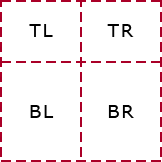
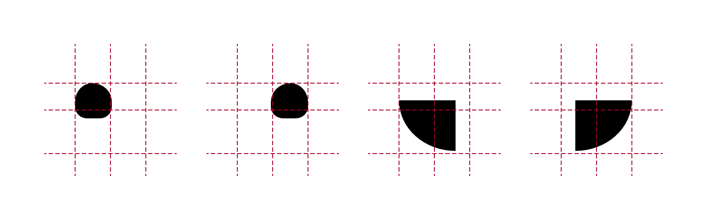
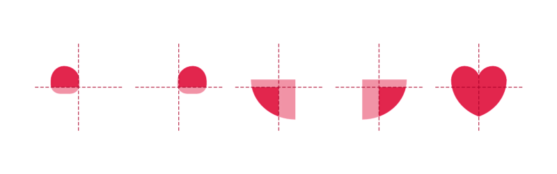

原文地址：[Twitter’s Heart Animation in Full CSS](https://medium.com/@OxyDesign/twitter-s-heart-animation-in-full-css-b1c00ca5b774#.pndd8brke)

# Twitter’s Heart Animation in Full CSS
# CSS 实现Twitter 的“爱心动画”

A few weeks ago, as everybody, I saw the Twitter Star turned into a Heart. The favorite into a like.

几周前，我发现 twitter 的“喜欢”不再使用星星的图标，而是变成一颗爱心。将“最爱”变成了”喜欢“。

twitter 官方也[发推](https://blog.twitter.com/2015/hearts-on-twitter)说了这事儿

> You can say a lot with a heart. Introducing a new way to show how you feel on Twitter: https://blog.twitter.com/2015/hearts-on-twitter ... pic.twitter.com/G4ZGe0rDTP
  爱心，一种新的表达你对一条 twitter 的方式：

That was a huge source for debates for sure … but the only thing that I had in mind was … is it possible to make it with only CSS (not a single picture or SVG) ?

这一改动肯定是经过了各方拉锯，不过我关心的只是，爱心动画可不可以用 CSS 实现呢？我指的是“纯 css”，不是一张图片或者 SVG。

I know it’s not a matter of life and death but when something like that gets in my head it’s too late, I can’t sleep until I have a viable answer.

我知道这并不是一个事关生死的问题，但是既然我有了这个想法，就一定要实现出来，不然根本睡不着觉啊。

After a few trials on this challenge I finally have my answer. The result is not perfect (and it’s a lot of SCSS / CSS — almost 400 lines) but it’s satisfying (based on my expectations at least).

在经过一些尝试之后，我终于实现了。不过你可能会觉得我的代码不够漂亮，毕竟 400 行之长 SCSS/CSS 代码真的也不算回事儿嘛，不过对我来说，能找到这个方案已经很高兴了。


I will now describe the steps I went through to find it.

接下来，你会读到我的心路历程。

First I divided it in 3 layers : the Heart (.heart), the Ring (.ring) and the Circles (.circles), and grouped them in a wrapper (.heart-wrapper). After this, I made the drawing for each layer, then the animation of each layer and finally mixed them all together.

首先，我把这个效果分成了三个层级：爱心（```.heart```）、环形（```.ring```）以及圆形（```.circles```），接着将它们三个都放进 ```.heart-wrapper``` 这个容器中。然后分别绘制每个层级，接着实现对应的动画，最后把所有动画整合到一起。

## Drawing
## 绘制

### Heart
### 爱心

First part was the Heart.
首先我们要搞定的是爱心。

I separated the full area in 4 rectangles :
我把整个形状分成了四块矩形区域：

+ Top / Left and Top / Right : 25% high / 50% wide
+ 左上和右上区域都是占总高度的 25%，总宽度的 50%

+ Bottom / Left and Bottom / Right : 75% high / 50% wide
+ 左下和右下区域是占总高度的 75%，总宽度的 50%



And I used a pseudo element (:after) inside every rectangle and played with border-radius property to be as close as possible to the original shape for each part.

接着在每个矩形结构中，我都使用上设置了 ```border-radius``` 值的伪元素（```:after```），尽可能地模拟每个对应部分的形状。



Then I applied the color and overflow:hidden

接着再使用 ```color``` 和 ```overflow:hidden```：

