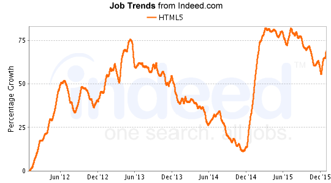
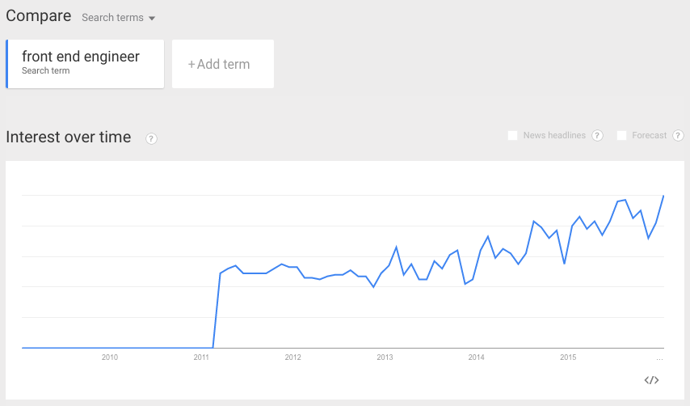
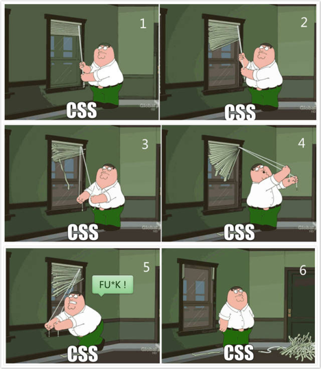
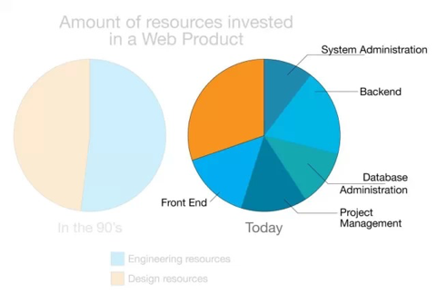

# 为什么整个互联网行业都缺前端工程师？

> 本文来自 100offer 团队原创投稿，转载需授权。封面图片出自：www.adhamdannaway.com
部分内容译自：jjperezaguinaga.com

现在，几乎整个互联网行业都缺前端工程师，不仅在刚起步的创业公司，上市公司乃至巨头，这个问题也一样存在。没错，优秀的前端工程师简直比大熊猫还稀少。

每天，100offer的HR群都有人在吐槽招不到前端工程师。实话说对这些需求， 我们100offer也无能为力，因为在供不应求的前端招聘市场上，优秀的前端工程师才是有话语权的那一方。

放眼全球，不仅在国内的互联网行业，在国外，前端工程师一样是需求旺盛、供不应求的香饽饽。

举个例子，根据indeed.com抓取的数千家网站的职位显示：目前前端的热门岗位——**「HTML5」是需求增长最快的开发岗位，在所有开发职位中排名第一**，MongoDB和iOS紧随其后位列第二、第三。

可见，HTML5可以说是最热门的前端岗位了，在2010年和2014年底有两次爆发性增长，现在在美国的岗位需求甚至超过了iOS。

所以市场上优秀的前端工程师相对较缺少，是一个世界性难题。

## 原因一：前端相对来说是一个新领域，当今的web需求要求更多的工程师供应

可能很多人认为前端开发和web开发类似，而web开发已经有20多年的历史，所以前端并不是一个新领域。然而，**前端工程师的概念中的「接口技术实现和用户体验作为一个专业的工作领域」**，却无疑是很新的。大概几年前，前端开发的技术增长迅猛，如下图所示：

过去几年前端工程师的可视化增长趋势 by Google Trends

15年或更久以前，web的可视化设计和技术实现所需要的资源是平均分配的。随着网站的发展——网站不仅是一个登录页面，工程资源的需求越来越明显。人们开始专门学习网站专用的JS、后端技术、UX、数据库，甚至系统设计。

今天，**一个像AirBnB/Facebook/Quora的Web应用程序，投入的工程资源比设计资源多得多**。换句话说，如今，做出网页的视觉设计比技术实现要更快，所以当今的web需求要求更多的工程师供应。

现在，一位合格的前端工程师，必须对视觉设计有兴趣（或者乐于做一个受虐狂▼）。

很显然，要处理大量的Web应用程序需求，技术任务就要进行分类，以便于多人同时处理网站请求。事实上现在已经不可能一个人快速地解决所有的技术细节了。

现在还有一类人是独自处理一个Web应用程序的所有问题，即「全栈工程师」，但是优秀的全栈工程师同样如大熊猫一般数量稀少。

现在，一个创业公司想要成功，几乎要覆盖一个Web应用程序的诸多技术方面：前端、后台、DBA、运营等。虽然已经有一些服务可以让企业购买登陆页面的前端模块和组件；但是如果你想要创造一些真正的Web应用程序，除了求助前端工程师，别无他法，就像你要创立一个品牌你也绕不开请一位设计师一样。

## 原因二：对前端，普遍存在巨大的误解，其实前端一点也不简单

大多人都认为前端开发是一个「相对于其他模块来说更简单的领域」，在他们心中的前端工程师是这样工作的：

1. 把Photoshop文件、图片或者线框放进一个网页；
2. 偶尔设计Photoshop文件、图片或者线框；
3. 用JS编程，为网页制作动画、过渡效果；
4. 用HTML和CSS编程，确定网页的内容和形式。

**事实上，前端工程师在做的是：**

1. 在设计师和工程师之间创建可视化的语言；
2. 用可视化的设计，定义一组代表内容、品牌和功能的组件；
3. 为Web应用程序的公约、框架、需求、可视化的语言和规格设定底线；
4. 定义Web应用程序的设备、浏览器、屏幕、动画的范围；
5. 开发一个质量保证指南来确保品牌忠诚度、代码质量、产品标准；
6. 为Web应用程序设定适当的行距、字体、标题、图标、余粮、填充等等；
7. 为Web应用程序设定多种分辨率的图像，设备为主的实体模型，同时维护设计指南；
8. 用account semantics, accessibility, SEO, schemas ，microformats 标记Web应用程序；
9. 用一种友好的，消耗小的，设备和客户端感知的方式连接API，获取内容；
10. 开发客户端代码来显示流畅的动画、过渡、延迟加载、交互、应用工作流程，大多数时间用来考虑渐进增强和向后兼容的标准；
11. 保证后台连接安全，采取跨地资源共享（ CORS ）的程序考虑，防止跨站点脚本（ XSS）和跨站点请求伪造（ CSRF ） ；
12. 最重要的是，尽管有严格的期限、利益相关者的要求，以及设备的限制，无论现在还是将来永远是「客户第一」。

为了实现上述目标，前端工程师采用了从可视化到编程的多种工具 ，甚至有时要照顾市场、 UX 到内容tweakes等等。

## 原因三：大量糟糕前端工程师的存在，扰乱了市场

这或许是难以招到优秀前端工程师最明显的原因。由于前端工程师的入门门槛非常低，JS、CSS、HTML并不是很难入门掌握的语言，似乎只要花一点时间，谁都可以通过网上教程和书本学会它。对的，前端工程师市场就是被这些浅尝辄止的家伙搞坏的。

糟糕的前端工程师是这样做事的：

1、滥用JS库，因为他们实际上并不了JS的内部（e.g. 一切都用jQuery）；
2、滥用JS插件，抄别人的代码哪怕自己根本读不懂（e.g.jQuery.doParallaxPls.js）；
3、给Web应用程序添加CSS框架，却只用到CSS/JS的5%，没有看到任何的需求、设计或者比较和评价；
4、认为只要添加了CSS框架，网站就可以「有求必应」；
5、一边在说着「响应式web设计」，却对服务器端技术一无所知；
6、用CSS编程时不管预处理器、命名规范等，却用不合适的selector/ids/magic numbers等；
7、忽视表现、内存泄露（并不理解内存泄露的真正含义），不会检测代码；
8、不会用指标衡量一个产品，或者这种指标旨在自己的电脑、浏览器、设备有效；
9、忽视软件技术。

要知道，入门容易精通难，计算机和软件的基础对你用JS或浏览器编程都非常重要。web可能是最有影响力的平台和环境之一，在那里执行的程序必须被小心对待。**一位优秀的前端工程师不仅要考虑web技术和语言，并且还要了解所有不同的组件、系统和概念**。

以下是优秀的前端工程师在即时面对普通的任务也会做的事情（**这才是市场急需的前端**）：

1. DNS解析、使用CDN和关于multiple Hostnames as part of resources request.
2. HTTP Headers (Expires, Cache-Control, If-Modified-Since)
3. Steve Souders的所有规则(High Performance Websites)
4. 如何解决PageSpeed, YSlow, Chrome Dev Tools Audit, Chrome Dev Tools Timeline显示的所有问题；
5. 何时把任务传到服务器和客户端；
6. 缓存，预取和负荷技术的使用；
7. Native JS，知道何时从头开始做，何时查找别人的代码，同时可以评估这样做的优缺点；
8. modern MVC Javascript libraries (e.g. AngularJS, EmberJS, ReactJS), graphic libraries (e.g. D3, SnapSVG), DOM manipulation libraries (e.g. jQuery, Zepto), lazy loading or package management libraries (e.g. RequireJS, CommonJS), task managers (e.g. Grunt, Gulp), package managers (e.g. Bower, Componentjs) and testing (e.g. Protractor, Selenium)的相关知识和用法；
9. CSS标准、modern conventions、 strategies (e.g. BEM, SMACSS, OOCSS)的知识和用法；
10. JS的电脑知识（内存管理，单线程的性质，垃圾收集算法，超时，范围，提升，模式）

换句话说，如果说精通HTML+CSS+JS，了解后端知识，只是60分的合格前端；那么要想成为受追捧、拿高薪的80分优秀前端，要对业务需求和、架构设计有真正的运用；**而100分的顶级前端，则必须要能够兼顾技术和设计，更接近「以前端开发为主的全栈工程师」了**。

## 100offer 说：市场不是缺少前端，而是缺少优秀的前端工程师

现在，前端工程师终于前所未有的在web中占有了一席之地。随着多设备、浏览器和Web标准的演变革命，**前端正在成为兼顾逻辑、性能、交互、体验的综合性岗位**。

虽然现在互联网行业普遍缺少前端工程师，但是我们相信越来越多的人将会加入前端的大军。不仅是因为大多数前端工作提供的优渥薪水和办公环境，也是因为web中的前端编程变得越来越有挑战和意义。

最后，分享一组2015年3~4月跳槽高峰期的100offer拍卖数据，给前端们鼓鼓劲：

前端工程师人均收获**8.2个面试机会**，已入职的前端工程师平均**薪资涨幅达39%**。其中，前端offer之王共收获47个offer，最高offer薪水38k*16 ，开自某土豪电商。

**加油吧，前端！**

