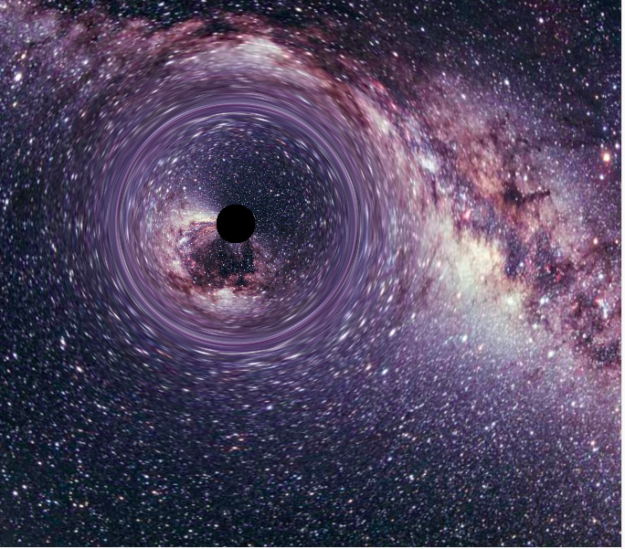
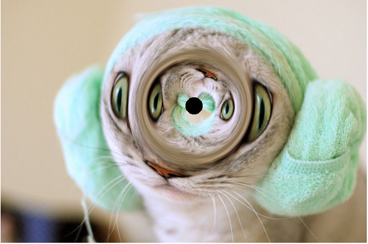

# black-hole.js

# 黑洞.js

Black holes are like the grand edge cases of nature, places where our understanding of quantum and classical mechanics breaks down. They have forced physicists to face some truly bizarre ideas, such as the possibility that our universe may be a hologram with all of its information stored on a massive two dimensional surface surrounding us. They are places of paradox: it might actually be true that explorers who venture across a black hole’s horizon may fly through without noticing a thing, while observers on the outside would observe the explorer getting thermalized and spread across the black hole’s horizon, and both histories may be right. Bizarre. Also, they look really cool.

黑洞仿佛就是一个宏达的自然边界，在黑洞里，我们所知的量子理论和经典力学都将失效。物理学家逼不得已产生了一些实在奇怪的想法，比如我们的宇宙是一个全息图，它所有的信息都存储在一个巨大的围绕着我们的二维表面上。物理学家们被置于一个矛盾的潘多拉魔盒中：毫无疑问，对于探险者来讲，当自身全部穿过黑洞时，可能不会发现有什么异样，但是，外面的观察者可能会看到探险者在横穿黑洞时，被撕扯变形，这两个故事很可能都是对的，匪夷所思吧。无论如何，这很屌吧。

In Nolan’s Interstellar, a giant black hole looms menacingly and majestically in space, its swirling light shows defying comprehension. The movie was my first introduction to the beauty of gravitational lensing, a concept I’d often read described in physics coursebooks but never seen demonstrated so compellingly. I decided recently that I wanted to learn how gravitational lensing worked and see if I could put such knowledge to use.

在诺兰的电影《星际穿越》中，一个巨大的黑洞置于太空之中，险峻而庄严，它对光的限制超出常理。我从这部电影中第一次感受到了引力透镜的优美，以前经常在物理的教科书里面看到引力透镜这个概念，但是从来没有看到过这么引人入胜的阐释。因此最近我决定研究一下引力透镜，看看能用学到的东西做点什么。

Thus in the time-honored tradition of taking yet another noun and making .js file out of it, I proudly present black-hole.js (see on GitHub), which uses a numerical ordinary differential equation solver from numeric.js, and some nice WebGL utilities from glfx.js, to render the gravitational lensing of a black hole.

沿用通常的做法，选一个名词，做一个 .js 文件，我非常傲娇地释出 [black-hole.js（GitHub）](https://github.com/cliffcrosland/black-hole.js)。它利用 numeric.js 的数值微分方程求解器，和 glfx.js 漂亮的 WebGL 绘制工具，来渲染出黑洞的引力透镜。

## Demo

## 示例

在下面的画布上移动你的鼠标，可以看到一个黑洞会跟着移动。

> 译注：由于知乎专栏的限制，可以到原文 [black-hole.js](http://cliffcrosland.tumblr.com/post/115981256393/black-hole-js) 查看效果。

## What is gravitational lensing?

## 引力透镜是什么？

One of Einstein’s foremost contributions to physics was the idea that gravity not only attracts discrete masses to one another, it actually warps the fabric of space itself. This means that even infinitesimally lightweight photons are attracted to the heavy celestial bodies in the universe. Black holes are well known for the fact that their powerful gravity traps light itself within its horizon, making a spherical region of space completely devoid of light (hence their name). But you can imagine that rays of light that pass near the edge of the black hole might be bent in fiercely but perhaps not hard enough to be trapped.

爱因斯坦对物理做出的杰出贡献之一就是提出这样一种观点——引力除了让物体互相吸引之外，还会造成空间本身的扭曲。也就是说，在宇宙中，就算是微不足道的、几乎没有质量的光子都会受到巨大天体的吸引。有一个关于黑洞的普遍的共识就是，它们强大的引力可以把光线限制在黑洞的边缘内，让一个球形的空间内没有一点光亮（这也是名字的由来）。但想想看从黑洞边缘经过的那些光线，它们一定会发生强烈的弯曲，但是很可能不会被捕捉到黑洞中。

There are several strange phenomena near the edge of the black hole. Elements far to one side of the black hole may show up near it on the other side due to the fierce warping of space. Light rays that bend very near the black hole’s horizon may actually wrap back around to the viewer, meaning that you should actually be able to see yourself in some of the light that bends around the black hole.

在黑洞的边缘存在几种奇怪现象。由于空间强烈弯曲，距离黑洞一边较远的元素很可能出现在靠近另一边的位置上；非常靠近黑洞边缘的被弯曲的光线很可能绕一圈回来达到观察者的眼睛里，这意味着你很可能在被黑洞弯曲的光线中看到你自己。

If we want to compute these gravitational lensing effects, we’ll need to dig a bit into the math of what is going on. There are some decent explanations and formulas for explaining gravitational lensing on Wikipedia, but the best summary I found was an excellent post by Jason at jasmcole.com. Feel free to visit his post to learn more about the physics of gravitational lensing in detail.

如果想要计算这些引力透镜效果，我们需要深入了解一点数学相关的只是。在 Wikipedia 上有严谨的解释，也有通俗的，但我找到了一个最好的总结，即 Jason 发布在 jasmcole.com 的一篇博文。自行查看他的这篇文章，学习关于引力透镜的详细的一些物理细节。

Source of image is [jasmcole.com](http://jasmcole.com/2014/10/04/what-do-black-holes-look-like/)

图片来自 [jasmcole.com](http://jasmcole.com/2014/10/04/what-do-black-holes-look-like/)

If we have a light ray leaving the viewer toward the black hole at an angle θin, and the viewer is at a distance r0 from the black hole, it would be useful to determine the final angle θout as the light recedes far away from the black hole. We can trace the ray’s path around the black hole in polar coordinates where r is the distance from the black hole and ϕ is the angle between the photon and the axis between the viewer and the black hole. To my knowledge, there is not a closed-form solution relating θin and θout, but, thanks to the physics expertise from Jason of jasmcole.com, here is a simple ordinary differential equation relating these quantities. 

如果有一束光线从观察着的眼睛中发出，以 \theta_{in}  的角度射向黑洞，观察者与黑洞距离为 r_0，如果能够知道光线远离黑洞时的角度 \theta_{out} 就好了。我们可以使用极坐标（r 为距离黑洞距离， \phi 角为光子、黑洞和观察者三者形成的夹角）来跟踪黑洞周围光线的路径。据我所知，对于 \theta_{in} 和 \theta_{out} 之间的关系没有闭型解（closed-form solution），但是，要感谢 jasmcole.com Jason 专业的物理知识，有一个常微分方程可以表示这些量之间的关系。

> 闭型解：用基本函数（例如多项式、三角函数、对数指数函数等等）及特殊函数给表达出来的解，或者说是能以某种确定形式表达出来的解。——译注

\frac{d^2(1/r)}{d \phi^2} + \frac{1}{r} = \frac{3 G M}{c^2 r^2}

To simplify even further, we can substitute u for 1r, and choose units such that G = M = c = 1, giving us a very simple 2nd order ODE: 

进一步简化，使用 u 代替 \frac{1}{r}，令 G = M = c = 1，我们得到了一个很简单的二阶微分方程（2nd order ODE）。

\frac{d^2 u}{d \phi^2} = 3 u^2 - u

If we solve this ODE for a single value of θin, we can view the x-y coordinate photon path and analyze where the photon ends up. Repeating this for many values of θin will provide enough data to create a mapping between θin and θout. You can use MATLAB or similar tools to solve the ODE, but because I wanted to create a JavaScript widget and ultimately allow its parameters to be configurable, I resorted to using numeric.js, a cool mathematics library with a nice workshop REPL online that you can use to plot graphs and debug.

如果我们针对单个 \theta_{in} 求解这个微分方程，我们可以知道光子路径的 xy 坐标，并找出光子最终会落在什么地方。重复对多个 \theta_{in} 求解，我们将会获得足够多的数据，找到 \theta_{in} 和 \theta_{out} 的对应关系。你可以使用 MATLAB 或者类似的工具来求解这个微分方程。但是因为我想创建一个 JavaScript  组件，并且最终参数都是可以配置的，所以我决定使用 numeric.js，一个非常棒的数学计算类库，有在线的试验台 REPL 可用，有曲线图，也可以调试。

## Solving a 2nd order ODE with numeric.js

## 使用 mumeric.js 来求解 2nd order ODE（二阶微分方程）

The numeric.js library comes packed with many useful mathematical tools, which you can read about here, and try out in the online workshop REPL here. The one that is interesting for our use case is the numeric.dopri() function, which performs numerical integration of an ODE using the Dormand-Prince RK method. In other words, this function will take in an ODE and output a large series of points that fit the ODE constraints, which you can then plot.

numeric.js 包含了很多有用的数学工具，你可以到[这里学习](http://numericjs.com/documentation.html)，并可以在[在线试验台试试看](http://numericjs.com/workshop.php)。对于我们来讲  `numeric.dopri()` 是我们比较关心的一个函数，它采用 Dormand-Prince RK 方法进行微分方程的积分运算。通俗解释就是这个函数接受一个微分方程作为输入，输出一系列很多的满足微分方程限制的点，这样我们就可以把图绘制出来了。

Let’s see if we can get our ODE into a form that numeric.dopri() can accept. It expects our ODE to come in the form of a function with two parameters: the independent variable (in our case ϕ), and a vector of two dependent variables, u and u′, in our case. It then expects us to return a vector containing the values u′ and u″. We can write down this ODE function as follows:

试试看能不能把我们的微分方程转成 `numeric.dopri()` 可以接受的形式。这要求我们的微分方程变成一个接受两个参数的函数的形式：一个独立的变量（我们这里就是 \phi），以及一个矢量包含两个独立的变量，在我们这里就是 u 和 u' 。然后它还期望我们返回一个矢量，包含 u' 和 u''。写出来的微分方程函数如下：

    var blackHoleODESystem = function (phi, vec) {
      var u = vec[0];
      var u_prime = vec[1];
      var u_double_prime = 3*u*u - u;
      return [u_prime, u_double_prime];
    }

In order to solve our ODE, numeric will need to know initial values for u and u′. Simply enough, u0=1/r0, and we can use some geometry to find that u′0=1/(r0⋅tan(θin)). In my own experiments, I found that setting r0 to 20 yielded nice results. You can play with varying angles for θin and see what the paths look like, but I found that θin≤15∘ yielded paths that fell into the black hole, and around 16∘ to 18∘ yielded paths that wrapped around and came back toward the viewer.

为了求解我们的微分方程，numeric 需要知道 u 和 u' 的初始值。不复杂，u_0=\frac{1}{r_0}，然后可以通过几何学的方法找出 u'_0=\frac{1}{r_0⋅tan(\theta_{in})}。根据经验，我发现把 r_0 设置 20 可以产生更漂亮的结果。你可以使用不同的 \theta_{in} 来测试看看路径是什么样子，我发现当 \theta_{in} < 15° 时，路径会掉入到黑洞中，在 16° 和 18° 之间时，产生的路径会转一圈回到观察者的眼里。

With our system and initial values determined, we can call numeric.dopri() to give us coordinates that match the ODE constraints:

有了系统的初始值，我们可以调用 `numeric.dopri()` ，给出满足微分方程的坐标：

    var getBlackHoleSolution = function (startAngle, startRadius, startPhi, endPhi, optionalNumIterations) {
      var numIterations = optionalNumIterations || 100;
      return numeric.dopri(
        startPhi, 
        endPhi, 
        [1.0/startRadius, 
         1.0/(startRadius * Math.tan(startAngle))], 
        blackHoleSystem, 
        undefined, // tolerance not needed
        numIterations
      );
    }

    var startAngleInDegrees = 15;
    var startRadius = 20;

    var sol = getBlackHoleSolution(
      startAngleInDegrees * Math.PI / 180, 
      startRadius, 
      0, 
      10 * Math.PI);

It’d be really nice to plot the x-y coordinates of this solution and watch the photon’s path around the black hole. Here’s a function that will do it.

要能把产生 xy 坐标绘制出来看到环绕黑洞的路径就好了。用下面这个方法可以实现：

    var getXYPhotonPathFromSolution = function (sol) {
      // Note: transpose(sol.y)[0] contains the u values. 
      // transpose(sol.y)[1] contains u_prime values.
      var rValues = numeric.transpose(sol.y)[0]
        .map(function (u) {
          // we want the radius r = 1/u
          return 1 / u; 
        });
      var phiValues = sol.x;
      var photonPath = [];
      for (var i = 0; i < rValues.length; i++) {
        // Negative r is nonsensical, and this can occur as 
        // radius goes to infinity. Stop when you start 
        // hitting infinity
        if (rValues[i] < 0) break; 
        var x = rValues[i] * Math.cos(phiValues[i]);
        var y = rValues[i] * Math.sin(phiValues[i]);
        photonPath.push([x, y]);
      }
      return photonPath;
    }

Finally, we can plot this x-y photon path using numeric.js’s workshop REPL. You’ll need to copy the functions above into the REPL to make them available for your use there.

终于，我们可以使用 numeric.js 的试验台 REPL 标出光子路径的 xy 坐标了。你需要把之前的函数拷贝到 REPL 中，这样你才可以在上面的函数中使用它们。

We can do a few operations in the REPL to plot our solutions. First, it is much easier to see your results if you set the bounds on the plot to be fixed, so first we set some default plot boundary options. Then, we create two solutions, one for a 15 degree light ray angle, and the other for a 40 degree angle. After that, we generate x-y photon paths for the two solutions. And finally, we plot the results.

为了在 REPL 中绘制答案，我们需要完成几个操作：如果把绘图的边界定死就可以很容易地看到结果，因此我们首先设置绘图默认的边界。接着，创建两个解，一个是 15° 角的光线，另一个是 40° 角。然后，我们获取这两个解的光子的 xy 路径。最后，绘制结果。

    > var plotOptions = { xaxis: { min: -20, max: 20 }, yaxis: { min: -20, max: 20 } }
    > var sol1 = getBlackHoleSolution(15 * Math.PI / 180, startRadius, 0, 10 * Math.PI);
    > var sol2 = getBlackHoleSolution(40 * Math.PI / 180, startRadius, 0, 10 * Math.PI);
    > var photonPath1 = getXYPhotonPathFromSolution(sol1);
    > var photonPath2 = getXYPhotonPathFromSolution(sol2);
    > workshop.plot([photonPath1, photonPath2]);

Here is a plot of several angles. Paths that begin with small initial angles swirl around and fall into the black hole. Angles slightly larger than those would allow the viewer to see around corners. Finally, the largest angles are only moderately deflected.

这里有多个角度的绘图结果。初始角度很小的路径在黑洞周围打了个转就掉了进去。稍微大一点角度的光线可以让观察者看到圆角，角度很大的光线只是稍微偏转了一点点。

## Creating a θin to θout fitted polynomial function

## 构造一个合适的从 \theta_{in} 映射到 \theta_{out} 的多项式函数 

Now that we can produce the x-y photon path for a given θin, how can we use this path to find θout? I found that assuming that sampling 100 initial angles between 0∘ and 80∘ works quite well. Given an x-y path for a photon, we do the following:

现在给定一个 \theta_{in} 我们可以得到光子的 xy 坐标路径，那我们如何根据这个路径找到 \theta_{out}。我发现把样本假定为100个在 0° 到 80° 之间的初始角度效果最好。给定一个光子路径的 xy 坐标，我们采取如下步骤：

- For small initial angles, there actually is no θout because those photons actually fall into the black hole. To determine if an x-y photon path falls into a black hole, we check to see if its final coordinate is within a small distance of the black hole at (0,0). We will ultimately find the largest initial angle that fell into a black hole and record it. Ultimately, pixels with smaller corresponding initial angles will be drawn black in the final image.

- For all other initial angles, the photon should end somewhere far from the black hole. We determine the final angle, θout by simply taking the arc-tangent of the slope between the final two points on the x-y path. Some of the resulting angles will indicate that the ray is shooting outside the bounds of the image, or even looping back around toward the viewer. What you decide to ultimately paint into such pixels is up to you because, unlike in nature, we don’t have full 3D image information of the surroundings. I ended up simply clamping to the nearest boundary pixel, which looks fairly good.

- 初始角度较小时，根本就没有 \theta_{out}，因为这些光线实际上直接跌入到黑洞中。要确定光子路径是否跌入到黑洞中，我们需要检查最终的坐标与黑洞（0,0）的距离是否在一个很小的距离内。我们将最终找到一个最大跌入黑洞路径的初始角度，并记住它；

- 对于其他的初始角度，光子最终离黑洞就有一定距离了。对于结果角度 \theta_{out} 的确定，我们只需要简单的通过在 xy 路径上最后两点的斜率的反正切值获取即可。在结果中，有些角度表示光线射到了图片边缘之外，还有的甚至转回到观察者的眼里。最终决定如何挥着这些点完全取决于你。因为，与自然界不同，我们没有周围完整的 3D 的图片信息。我最终就是简单地逼近到了最靠边的像素，看起来也还可以。

Once we have the in-angle to out-angle lookup table, we can generate a fitted polynomial function with the assistance of the numeric.uncmin() function. We can set up a “least squares” problem for numeric.js to optimize where the solution will choose coefficients for a polynomial function that will closely fit our data. I found that a simple 2nd degree polynomial function fit best. Here is the polynomial function:

一旦我们有了入射角度到射出角度的对应表，就可以借助 `numeric.uncmin()` 函数生成一个合适的多项式函数。我们可以给 numeric.js 设置一个“最小方差”问题来优化，为多项式函数选择最佳的系数以逼近我们的数据。我发现，有一个简单的二阶多项式函数匹配度最高。这个函数是：

f(\theta_{in}) = c_0 + c_1 \theta_{in} + c_2 \theta_{in}^2

Here is algorithm that numeric.js will use to minimize the square of the difference between the function’s results and our data. It will iteratively choose good coefficients ci until the function gets acceptably close to the data:

下面是 numeric.js 用来进行方差优化（函数求值结果与我们的数据之间的）的算法，它将不断地尝试有可能的 c_{i}，直到函数与数据非常接近：

- Choose c0, c1, c2, defining a new polynomial function f.
- Compute the following sum:
- ∑ni=0(f(θini)−θouti)2
- Iteratively improve c0, c1, and c2 until the sum above is acceptably minimized.

- 选择 c_0、c_1、c_2，确定一个新的多项式函数；
- 计算下面这个公式的和：
- \sum_{i = 0}^{n} (f(\theta_{in_i}) - \theta_{out_i})^2
- 不断调整  c_0、c_1 和 c_2 的值，直到上式的结果足够小。

Here’s what this process looks like in JavaScript:

用 JavaScript 表示这个过程如下：

    var angleTables = computeBlackHoleTables(startRadius, numAngleDataPoints, maxAngle, optionalNumIterationsInODESolver);
    var polynomial = function (params, x) {
      var sum = 0.0;
      for (var i = 0; i <= polynomialDegree; i++) {
        sum += params[i] * Math.pow(x, i);
      }
      return sum;
    }
    var initialCoeffs = [];
    for (var i = 0; i <= polynomialDegree; i++) {
      initialCoeffs.push(1.0);
    }
    var leastSquaresObjective = function (params) {
      var total = 0.0;
      for (var i = 0; i < angleTables.inAngles.length; i++) {
        var result = polynomial(params, angleTables.inAngles[i]);
        var delta = result - angleTables.outAngles[i];
        total += (delta * delta);
      }
      return total;
    }
    var minimizer = numeric.uncmin(leastSquaresObjective, initialCoeffs);
    var polynomialCoefficients = minimizer.solution;

## Using some geometry to render the result

## 借助简单的几何学渲染结果

The drawing above demonstrates the approach. It shows a possibility where, when trying to determine what should be painted to the location at the red dot in the final image, we find that we should paint the contents from the location of the green dot in the original image.

方法如上图所示。当要确定在最终图片红点位置上应当绘制什么时，它给出了可能的答案。我们发现应该绘制的来自于原始图片绿点的内容。

The algorithm works as follows. First, we need to determine the distance from the viewer to the image plane in “pixel space.” Since we’ve specified an FOV angle, that distance is B=diagonal/(2⋅tan(fov/2)). Then, we can then compute the angle θin for any x-y pixel coordinate. 

算法如下。首先，我们需要确定观察者里“像素空间”里的图像平面的距离。既然我们已经指定了一个视角，那距离就是 B = diagonal/(2 \cdot tan(fov/2))
，接着，就可以计算任何坐标为 xy 像素的入射角 \theta_{in} 了。

d = \sqrt{(x-x_{bh})^2 + (y-y_{bh})^2)} \\
\theta_{in} = arctan \frac{d}{B}

Now that we have θin for a given x-y pixel, how do we determine its corresponding θout? We created a fitting polynomial function above, call it f(θin). Simply call this function to get θout. If this θout is less than the black hole angle, we paint black. If it is greater, we find its distance from the black hole center, dout=B⋅tanθout. This value may be negative or positive depending on the angle θout. If negative, then (xout,yout) will be on the opposite side of the black hole of (xin,yin). The x-y out-location can be found my creating a unit vector between the x-y in-location and the black hole, and multiplying it by the distance value dout.

现在对于给定的 xy 坐标我们已经有了 \theta_{in}，我们该如何确定对应的 \theta_{out} 呢？之前我们已经创建了一个合适的多项式函数，f(\theta_{in})
。调用这个函数就可以获得 \theta_{out}。如果这个 \theta_{out} 小于黑洞的角度，我们就描黑。如果大于黑洞的角，我们求出它里黑洞的距离，d_{out} = B \cdot tan \theta_{out}。距离的值有可能为正，也有可能为负，取决于 \theta_{out} 的值。如果为负，(x_{out}, y_{out}) 将出现在黑洞 (x_{in}, y_{in}) 的另一个方向。射出的 xy 坐标可以这样计算出来：射入点 xy 和黑洞之间的单位向量乘以射出时的距离 d_{out}。

And there you have it.

然后射出点的坐标就有了。

## HTML5, WebGL, and shaders, oh my!

## 我的天 HTML5、WebGL 和 着色器！

My first attempt to render the black hole in the browser was both exhilarating and disappointing. Using HTML5 Canvas and ImageData objects, I was able to produce a rendering of a static black hole in the center of a background image quite quickly. However, when I modified the plugin such that the black hole followed my mouse around the background image, the program stuttered badly, with approximately 300 - 400 ms of latency between each frame. I tried several HTML5 hacks, to no avail.

我第一次尝试在浏览器中绘制黑洞时那是悲喜交加呀。使用 HTML5 Canvas 和 ImageData 对象，我可以很快地在背景图片的中央绘制一个静态的黑洞。但当我修改插件，让黑洞可以跟着我的鼠标在背景图片上移动时，程序就开始死命的卡了。帧和帧之间有大约 300 ~ 到 400 ms 的延迟。是尝试了几个 HTML5 hack，但是没什么效果。

This rendering process seems inherently parallelizable, however. Initial angles mapped independently to output angles with no dependencies on computation from other neighbors. This should certainly be something that a GPU should be able to handle well. I decided that now was as good a time as any to learn a bit about WebGL GLSL shaders.

要知道，渲染过程本身其实是可以并行的。初始角度可以独立地生成输出角度，之间没有什么依赖。GPU 应该能够很好地处理这种事情。我决定学习 WebGL GLSL 着色器的时间到了。

> GLSL：OpenGL着色语言（OpenGL Shading Language）是用来在OpenGL中着色编程的语言，也即开发人员写的短小的自定义程序，他们是在图形卡的GPU （Graphic Processor Unit图形处理单元）上执行的，代替了固定的渲染管线的一部分，使渲染管线中不同层次具有可编程型。比如：视图转换、投影转换等。GLSL（GL Shading Language）的着色器代码分成2个部分：Vertex Shader（顶点着色器）和Fragment（片断着色器），有时还会有Geometry Shader（几何着色器）。负责运行顶点着色的是顶点着色器。它可以得到当前OpenGL 中的状态，GLSL内置变量进行传递。GLSL其使用C语言作为基础高阶着色语言，避免了使用汇编语言或硬件规格语言的复杂性。——[百度百科](http://baike.baidu.com/view/1620896.htm)

There was substantially more necessary boilerplate code involved in drawing things with WebGL than I’m used to as a web and mobile -focused engineer. I wanted to keep my WebGL code as succinct as possible, leveraging any other open source work I could so that my program could focus on the interesting gravitational lensing concepts. I found a very nice foundation to build on. The glfx.js library is fantastic. Their home page demo even prominently displays a swirling black hole-esque effect than follows the mouse around at a high frame rate. This definitely felt like the right direction.

作为了一个 Web 和 移动为主的工程师来讲，使用 WebGL 来绘制东西有大量的模板代码需要编写。我想尽量保持 WebGL 代码的简洁，希望可以借助任何开源的类库，让我们程序可以把注意力放在有趣的引力透镜上。我找到了一个非常不错的可作为基础的类库。[glfx.js](http://evanw.github.io/glfx.js/) 这个库真的很棒。它的主页甚至在明显的位置展示黑洞漩涡式的效果，可以跟着鼠标的移动，帧率很高。这绝对就是正确的方向。
 
The glfx.js library offers easy use of many interesting effects that you can apply to 2D images, from swirling vortexes to bulging lenses. I tried at some length to extend it with a black hole rendering function, but ultimately I had to modify glfx.js itself.

glfx.js 提供了很多有趣且易用的效果，从漩涡到鼓起的镜头应有尽有，可以用在 2D 图片上。我做了相当的尝试给它扩展出一个黑洞渲染函数，但最终我还是修改 glfx.js 的代码。

The black hole effect is created via a GLSL shader. It is definitely a bit tough to debug GLSL: there is no console.log. It was interesting to run up against the constraint that you are only allowed to access arrays using either a constant integer index or sequentially in a for loop. Ultimately, GLSL was fun to play with, since the development process involved tweaking small bits and watching thousands of pixels fly around in disarray until the final solution was met.

黑洞的效果是通过 GLSL 着色器创建的。GLSL 调试起来真的有点难：因为没有 `console.log`。有趣的是常常会碰上这样的限制——只允许使用一个固定的整数索引或者在一个 for 循环中依次访问一个数组。最终，GLSL 很好玩，开发过程需要不断的做出小的微调，看着成千上万的像素掉到处乱飞，直到达到最终的效果。

In GLSL, you define “uniform” values that are the same across all pixels being process by the GPU. For the algorithm to work, I needed to pass in several important values there: the black hole x-y coordinates, the maximum “trapped in black hole” angle, the distance from the viewer to the image plane in “pixel space”, and, hardest of all, the angle polynomial coefficient tables. It was straightforward to determine the type of most of the values, all either float or vec2, which is a vector containing two floats.

在 GLSL 中，你需要定义统一的包含所有的像素的值让 GPU 去处理。为了让算法可以工作，我需要传递几个重要的值：黑洞的 xy 坐标，最大“陷入黑洞”的的角度，在“像素世界”中观察者到图像平面的距离，还有最难的，角度多项式表。大多数的值类型都很容易确定，基本上不是浮点数就是二维向量，即包含两个浮点数向量。

However, passing in the angle polynomial coefficient tables, which might have variable length, was trickier. You could do so by creating a sampler2D texture that has two rows, one row for the in-angles and one row for the out-angles, and initialize it in a roundabout way using a concoction of ImageData and Canvas objects. To my knowledge, that is the only way to import dynamically sized objects into a shader, and they are, by some accounts, slower for the GPU to work with than fixed size arrays. You can also import the angle polynomial coefficient tables as fixed size float[] arrays, but each array must have a constant size defined at compile time. My black hole shader, like the other shaders in glfx.js, was actually written as a string and passed to a Shader constructor. Hence, I could build the string at runtime and interpolate length values into the string as necessary, finally passing it to the Shader object for compilation.

然而，传递角度多项式表就有点困难，因为有可能包含变量的长度。你可以通过创建一个 sampler2D texture 来实现，包含两行，一行给入射角，另外一行给射出角，并通过协调 ImageData 和 Canvas 对象来拐弯抹角地初始化它。据我所知，要导入动态大小的对象到着色器中只有一种方式，而且，据统计，它们比起固定大小的数组来会减慢 GPU 的速度。你也可以把角度多项式表当做一个固定大小的浮点数数组导入，但是在编译阶段每个数组必须定义一个固定的大小。我的黑洞着色器，和 glfx.js 的其他着色器一样，实际上就是一段编写好的传递给着色器构造函数的字符串。因此，我可以爱运行时构建这个字符串，在必要时把长度插入到字符串中，最后将其传递给着色器对象去编译。

Here is the shader in all of its glory. Forgive all of the ugly ‘\’ characters to continue the same string onto new lines:

这就是着色器的全部。原谅我这里使用了 ‘\’ 字符，将同一个字符串分割到多行。

    /**
     * Gravitational lensing effect due to black hole.
     */
    function blackHole(centerX, centerY, blackHoleAngleFn, fovAngle) {
        var anglePolynomialCoefficients = blackHoleAngleFn.anglePolynomialCoefficients;
        var numPolynomialCoefficients = anglePolynomialCoefficients.length;
        gl.blackHoleShaders = gl.blackHoleShaders || {};
        gl.blackHoleShaders[numPolynomialCoefficients] = gl.blackHoleShaders[numPolynomialCoefficients] || new Shader(null, '\
        /* black hole vars */\
        uniform float distanceFromViewerToImagePlane;\
        uniform float maxInBlackHoleAngle;\
        uniform vec2 blackHoleCenter;\
        uniform float anglePolynomialCoefficients[' + numPolynomialCoefficients + '];\
        /* texture vars */\
        uniform sampler2D texture;\
        uniform vec2 texSize;\
        varying vec2 texCoord;\
        \
        float anglePolynomialFn(float inAngle) {\
          float outAngle = 0.0;\
          for (int i = 0; i < ' + numPolynomialCoefficients + '; i++) {\
            outAngle += anglePolynomialCoefficients[i] * pow(inAngle, float(i));\
          }\
          return outAngle;\
        }\
        \
        void main() {\
            vec2 coord = texCoord * texSize;\
            vec2 vecBetweenCoordAndCenter = coord - blackHoleCenter;\
            float distanceFromCenter = length(vecBetweenCoordAndCenter);\
            float inAngle = atan(distanceFromCenter, distanceFromViewerToImagePlane);\
            /* Completely black if in black hole */\
            if (inAngle <= maxInBlackHoleAngle) {\
                gl_FragColor = vec4(0.0, 0.0, 0.0, 1.0);\
                return;\
            }\
            float outAngle = anglePolynomialFn(inAngle);\
            float outDistanceFromCenter = tan(outAngle) * distanceFromViewerToImagePlane;\
            vec2 unitVectorBetweenCoordAndCenter = vecBetweenCoordAndCenter / distanceFromCenter;\
            vec2 outCoord = blackHoleCenter + unitVectorBetweenCoordAndCenter * outDistanceFromCenter;\
            outCoord = clamp(outCoord, vec2(0.0), texSize);\
            gl_FragColor = texture2D(texture, outCoord / texSize);\
        }');

        var h = this.height;
        var w = this.width;
        var distanceFromViewerToImagePlane = Math.sqrt(h*h + w*w) / Math.tan(fovAngle);

        simpleShader.call(this, gl.blackHoleShaders[numPolynomialCoefficients], {
            anglePolynomialCoefficients: {
              uniformVectorType: 'uniform1fv',
              value: anglePolynomialCoefficients
            },
            distanceFromViewerToImagePlane: distanceFromViewerToImagePlane,
            maxInBlackHoleAngle: blackHoleAngleFn.maxInBlackHoleAngle,
            blackHoleCenter: [centerX, centerY],
            texSize: [this.width, this.height]
        });

        return this;
    }

After my modifications to glfx.js, the final drawing code boils down to the following few lines.

在我修改了 glfx.js 之后，最终的绘图的代码精简到下面这几行：

    var blackHoleAngleFn = BlackHoleSolver
      .computeBlackHoleAngleFunction(
        distanceFromBlackHole, 
        polynomialDegree, 
        numAngleTableEntries, 
        fovAngleInDegrees);

    // ... on mouse move
    canvas.draw(texture)
      .blackHole(x, y, 
        blackHoleAngleFn, 
        fovAngleInRadians)
      .update();
  
And there you have it! Gravitational lensing for all. Even for Mr. Muffins:

搞定了，所有人的引力透镜！就是 Muffins 先生也是如此。

## I can haz demo too?

## 再来一个示例？

> 译注：由于知乎专栏的限制，可以到原文 [black-hole.js](http://cliffcrosland.tumblr.com/post/115981256393/black-hole-js) 查看效果。

原文：http://cliffcrosland.tumblr.com/post/115981256393/black-hole-js