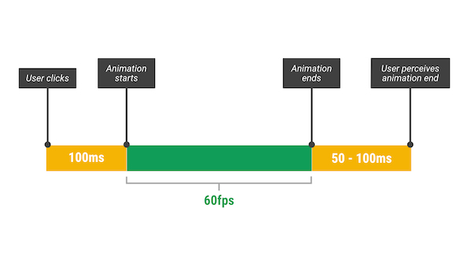

原文地址：[FLIP Your Animations](https://aerotwist.com/blog/flip-your-animations/)

# FLIP Your Animations
# 开启你的动画

Animations in your web app should run at 60fps. Not always easy to achieve that, and it really depends on what you're trying to do, but I'm here to help. With FLIP.

网页上的动画应该要达到 60fps 的帧率，这个目标并不是那么容易实现，你需要运用各种技巧才能完成这个目标，今天我介绍的 **FLIP** 可以帮助到你。

Recently I’ve had the pleasure of being part of the team that built building the Google I/O 2015 website, and last year I built the Chrome Dev Summit site. On both sites we used FLIP, which is essentially a principle, and not a framework or a library. It is a way of thinking about animations, and attempting to keep them as cheap as possible for the browser which, all being well, should translate over to 60fps animations.

最近我有幸参与到 [2015 Google I/0 的官方站点](https://events.google.com/io2015/)项目中，而且去年我也参与构建了 [Chrome Dev Summit 站点](https://developer.chrome.com/devsummit/)。在这两个项目中我们都使用了 **FLIP**。FLIP 不是一个框架也不是库。而是一种思考动画的方式，我们希望通过这个方式，在正常情况下，浏览器对动画的渲染都可以达到 60fps。

If you prefer watching to reading, this is my talk from Chrome Dev Summit, where I explain FLIP (without naming it explicitly) in lots of detail:

下面是我在 Chrome Dev Summit 上关于 FLIP （当时还没有给它一个正式的名字）的视频，视频中我详细解释了这个原则，你也可以通过视频了解 FLIP（观看该视频需要特别的姿势）。

<iframe width="560" height="315" src="https://www.youtube.com/embed/RCFQu0hK6bU" frameborder="0" allowfullscreen></iframe>

## The general approach
## 一个通用的方案

What we’re trying and do is to turn animations on their head (flip, see? Gosh darnit, I’m so funneh) and, instead of animating “straight ahead” and potentially doing expensive calculations on every single frame we precalculate the animation dynamically and let it play out cheaply.

我们想要做的是开启动画（看，就是 flip，开启。天了噜，我也太会取名字了吧！），而不是一帧一帧地执行动画，计算每一帧太昂贵了，我们想要预计算动画，然后再执行它，这样效率会高。

FLIP stands for First, Last, Invert, Play.

FLIP 指的是 **F**irst（起始）、**L**ast（终止）、**I**nvert（翻转）还有 **P**lay（播放）。

Let’s break it down:

现在让我们一个个来看：

+ **First**: the initial state of the element(s) involved in the transition.
+ **起始**: 元素的初始状态。

+ **Last**: the final state of the element(s).
+ **结束**: 元素的结束状态。

+ **Invert**: here’s the fun bit. You figure out from the first and last how the element has changed, so – say – its width, height, opacity. Next you apply transforms and opacity changes to reverse, or invert, them. If the element has moved 90px down between First and Last, you would apply a transform of -90px in Y. This makes the elements appear as though they’re still in the First position but, crucially, they’re not.
+ **翻转**: 有趣的来了，现在你已经知道了元素要如何从初始状态转变到结束状态，比如它的宽、高或者透明度要如何变化。下一步你将 ```transform``` 和 ```opacity``` 运用到反转元素上。举个例子，如果现在元素处在初始状态向结束状态的动画过程中的向下移动的 90px，那你需要在 Y 轴平移 -90px 才能在视觉上让元素看起来还是在起始位置。但事实是，它们的真实位置其实并不在那。

+ **Play**: switch on transitions for any of the properties you changed, and then remove the inversion changes. Because the element or elements are in their final position removing the transforms and opacities will ease them from their faux First position, out to the Last position.
+ **播放**: 在你改变了的属性上开启过渡（```transition```），然后移除反转。因为元素（们）在结束状态时的 ```opacity``` 和 ```transform``` 都会被改变（从假的初始状态到结束状态）。

Ta daaaaa!

## Got Code?
## 使用代码如何实现？

Why yes I do. Here’s that same breakdown in code:

来看看下面的代码：

```
  // 获取到元素的初始状态。
  var first = el.getBoundingClientRect();

  // 现在，让元素变到终止状态
  el.classList.add('totes-at-the-end');

  // 注意，这里是强行同步了布局，要小心使用
  var last = el.getBoundingClientRect();

  // 如果需要的话，你可以在其他需要计算的样式上应用这个方法。
  // 但要保证是在复合层上使用，比如被触发了 transform、opacity 这样的属性的元素
  var invert = first.top - last.top;

  // 翻转
  el.style.transform = 'translateY(' + invert + 'px)';

  // 下一帧渲染的时候，我们可以保证所有的属性已经发生了改变。
  requestAnimationFrame(function() {

    // 开启动画
    el.classList.add('animate-on-transforms');

    // 动画执行
    el.style.transform = '';
  });

  // 通过 'transitioned' 捕捉到结束点
  el.addEventListener('transitionend', tidyUpAnimations);
```

However, you can also do this with the upcoming Web Animations API, which can make things even easier:

不过，你也可以使用最新的 [Web Animations API](http://w3c.github.io/web-animations/)，代码将会更简洁易懂一些：

```
  // Get the first position.
  // 获取初始状态。
  var first = el.getBoundingClientRect();

  // Move it to the end.
  // 改变到结束状态
  el.classList.add('totes-at-the-end');

  // Get the last position.
  // 获取结束状态
  var last = el.getBoundingClientRect();

  // Invert.
  // 翻转
  var invert = first.top - last.top;

  // Go from the inverted position to last.
  // 从翻转的位置到结束位置
  var player = el.animate([
    { transform: 'translateY(' + invert + 'px)' },
    { transform: 'translateY(0)' }
  ], {
    duration: 300,
    easing: 'cubic-bezier(0,0,0.32,1)',
  });

  // Do any tidy up at the end of the animation.
  // 在动画结束时做点整理
  player.addEventListener('finish', tidyUpAnimations);
```

Right now you’ll need the Web Animations API polyfill to use the code above, though, but it’s pretty lightweight and does make life a lot easier!

不过现在如果你要使用 Web Animations API 的话，还需要结合 [polyfill](https://github.com/web-animations/web-animations-js) 使用，让自己的人生轻松一点！

If you want a more “in-production” context for FLIP check out the source for cards on the Chrome Dev Summit site.

如果你想要一个更“像生产环境”的 FLIP 代码，可以看看 [Chrome Dev Summit 上的代码](https://github.com/GoogleChrome/devsummit/blob/master/src/static/scripts/components/card.js#L263-296)。

## What is it good for?
## 这有什么好处？

It’s absolutely superb for times where you are responding to user input and then animating something in response. So, for example, in the case of Chrome Dev Summit, I was expanding cards that the user tapped on. Often the start and end locations and dimensions of the elements aren’t known, because – say – the site is responsive and things move around. This will help you because it’s explicitly measuring elements and giving you the correct values at runtime.

如果你能够用动画来响应用户输入那自然是极好的。比如在 Chrome Dev Summit 的网站上，当用户点击了卡片，卡片将会展开。通常元素的起始和终止状态的尺寸是未知的。因为站点是响应式的，页面上的元素都是环绕在一块。用 FLIP 这个方法，可以显式地处理元素，在运行时元素的当前值可以被计算出来。

The reason you can afford to do this relatively expensive precalculation is because there is a window of 100ms after someone interacts with your site where you’re able to do work without them noticing. If you’re inside that window users will feel like the site responded instantly! It’s only when things are moving that you need to maintain 60fps.

你之所以能做这样相对昂贵的预计算，是因为当用户与站点发生交互的时候，存在一个 100ms 的时窗，用户是不会察觉到在这 100ms 之内完成的动作的，只要在 100ms 之内，用户都会认为你的站点是很快的！只有当元素在移动的时候，你要保证帧率达到 60fps。



We can use that window of time to do all that getBoundingClientRect work (or getComputedStyle if that’s your poison) in JavaScript, and from there we make sure that we’re reducing the animation down to nice-and-fast, compositor-friendly, look-ma-no-paints transform and opacity changes. (Why just those? Check out my Pixels are Expensive post.)

我们可以利用这段时窗完成``` getBoundingClientRect ```（或者是``` getComputedStyle  ```），接着我们就能又快又好地执行动画，这么做对浏览器排版友好，也减少了 ```transform``` 和 ```opacity``` 引起的重绘（想知道为什么只有这两个？请阅读[这篇](https://aerotwist.com/blog/pixels-are-expensive/)）。

Animations that can be remapped to transform and opacity changes are the perfect fit. If you’re already limiting to those properties in your JS or CSS animations then you’re probably good to go; this technique works best when you’re changing layout properties (like width and height, left and top) and you want to remap them to cheaper properties.

只要动画可以映射到 transform 和 opacity 上，那就完美了。如果已经这么做了，那就说明你已经准备好了；这项技术在你想要改变布局属性的时候最好用，它可以把本来很昂贵的操作映射到对性能相对友好的属性上。

Sometimes you will need to rethink your animations to fit this model, and on many occasions I’ve separated and animated elements individually just so that I can animate them without distortion, and FLIP as much as possible. You may feel like that’s overkill, but to me it’s not, and for two reasons:

有时，你需要反复思考你的动画是否能套用到这个模型上。很多时候，我都先将动画分解，然后一个个地作用到元素上，防止出现形变，并且尽可能地触发 FLIP。你可能觉得这么做太过了，但我认为并非如此：

1. People want this. My colleague and friend Paul Kinlan recently ran a survey on what people want from a news app. The most popular answer (which was a surprise to him, at least) wasn’t offline support, sync, notifications, or anything like that. It was smooth navigation. Smooth, like no jank, no stutter, no judder. (/me mutters something about #perfmatters.)
1. **这是用户想要看到的。** Paul Kinlan 最近做了一个[调查](http://paul.kinlan.me/what-news-readers-want/)，想知道当人们使用一个新闻客户端时，他们在想些什么。**流畅**，既不是离线支持，也不是同步，更不是通知，而是**流畅**（在我看来，这就是**性能**问题）。

2. Native app devs do this. Of course this is a sliding scale and subjective, but I’ve heard many times of native developers spending days on end getting the transitions in their apps just right. Those “little touches” are a differentiator and, as we get faster loading sites through Service Worker, we’re going to be in the same boat. People will judge our sites based on how well they feel when they’re running.
2. **原生应用就是这么开发的。**好吧，这么说是有点夸大还带点主观色彩，但是我确实听过原生应用的开发者抱怨过一百遍关于调整动画的事。那些“小触碰”就是区分器，当我们借助 Service Worker 让站点加载地更快之后，我们也将面临这个问题。人们将会根据操作时的感受，来判定我们的站点。

## Some caveats
## 几点忠告

There are a couple of things to bear in mind if you FLIP:

当在使用 FLIP 的时候，你要注意：

1. Don’t exceed the 100ms window. It’s important to remember that you shouldn’t exceed that window, because your app will appear non-responsive if you do. Keep an eye on it through DevTools to know if you’re busting that budget.

1. **不要忘了 100ms 的限制。**千万不要超过这个时窗，不然用户会以为应用失去响应了。开发的时候，盯紧 DevTools 中的时间线。

2. Orchestrate your animations carefully. Imagine, if you will, that you’re running one of these animations all transformy and opacity-y and then you decide to do another, which requires a bunch of precalculation. That’s going to interrupt the animation that’s in flight, which is bad. The key here is to make sure your precalculation work is done in idle or the “response window” I talked about, and that two animations don’t stomp over each other.
2. **控制好动画的时间线。**假设，当前有一个 y 轴上的动画正在执行，此时你想要执行另一个动画了，那么浏览器就会进行大量的预计算，这样就会打断正在执行的 y 轴上的动画，这样做很不好。要避免这个问题，就要保证预计算是在理想状况下进行的，或者在上文中我所说的 100ms 时窗中完成了。两个独立的动画不应该相互影响。

3. Content can get distorted. When you’re working in a scale and transform world some elements can get distorted. As I said above I’ve been known to restructure my markup a little to allow me to FLIP without distortion, but it can end up being quite the wrangle.
3. **元素可能发生形变。**当你在使用 scale 之类的属性时，元素可能会被扭曲。我的经验就是，要调整 html 结构。不过为了 FLIP 而调整结构，这一点其实还颇有争议。

## FLIP on, as it were…
## 结束，大家开始使用 FLIP 吧！

I’ve come to love FLIP as a way of thinking about animations, because it’s a good match of JavaScript and CSS. Calculate in JavaScript, but let CSS handle the animations for you. You don’t have to use CSS to do the animations, though, you could just as easily use the Web Animations API or JavaScript itself, whatever’s easiest. The main point is that you’re reducing the per-frame complexity and cost (which normally means transform and opacity) to try and give the user the best possible experience.

现在我都是用 FLIP 的思维来思考动画这件事情的，我认为这是一个 JS 和 CSS 完美结合的例子。用 JS 完成计算，让 CSS 处理动画。你不再仅仅依靠 CSS 来执行动画，使用 Web Animations API 或者 JavaScript 会把事情变得简单。关键是，你减少了每一帧的复杂程度和计算成本（指的是 ```transform``` 和 ```opacity``` 的计算），用户体验更好了。

I have more to tell you about FLIP and a broader, unified model of performance, but that’s going to be the next blog post or so I’d say!

关于 FLIP 的话题，还有对性能的探讨，我还有很多想说，不过还是留到下篇博文见了！

So, uhh, FLIP on.

所以，快开启你们的 FLIP 之路吧。
